# experiments

Lab / showroom for AI agent experiments with **DSPy**, **MCP**, and **dapr-agents**.

## Lab Structure

```mermaid
flowchart LR
    subgraph Core["Core DSPy"]
        direction TB
        B1["01-basics<br/>Signatures, Predict, CoT"]
        B2["02-react-tools<br/>ReAct agent loop"]
        B3["03-rag-pipeline<br/>RAG + BootstrapFewShot"]
        B4["04-optimizers<br/>GEPA, MIPROv2, BetterTogether"]
        B5["05-rlm<br/>Recursive Language Model"]
        B6["06-advanced<br/>Streaming, Async, Ensemble"]
    end
    subgraph Advanced["Advanced"]
        direction TB
        A1["07-gfl<br/>Generative Feedback Loops"]
        A2["08-rlm-mcp<br/>RLM + MCP + BAMLAdapter"]
    end
    subgraph Evolution["Self-Evolving Agents"]
        direction TB
        P1["09_super_deep_research<br/>Multi-agent + LSE + KG"]
        P2["10_dapr_deep_research<br/>DurableAgent + DSPy deltas"]
        P3["11_meta_agent<br/>Dynamic agent generation"]
        P4["12_formal_evolution<br/>Z3 + Lean4 + OpenRouter MCP"]
        P5["13_autonomous_factory<br/>23 MCP servers + verification + IaC"]
        P6["14_durable_meta_agent<br/>DurableAgent + Dapr production framework"]
    end
    subgraph Util["Utilities"]
        S1["99-sandbox<br/>Scratch space"]
        S2["shared<br/>Env & config helpers"]
    end
    Core --> Advanced --> Evolution
```



## Quick Start

```bash
uv sync
cp .env.example .env   # fill in DEEPSEEK_API_KEY and configure models
```

## Running

## Documentation

Complete API reference for every module is in [`docs/`](docs/INDEX.md) — signatures, classes, functions, DSPy modules, and usage patterns for all 14 sub-projects.

## Running

Each sub-project is self-contained:

```bash
# Simple DSPy examples
python lab/01-basics/main.py

# MCP + RLM research agent (requires Crawl4AI Docker)
docker compose -f lab/08-rlm-mcp/docker-compose.yml up -d
python lab/08-rlm-mcp/main.py

# Self-evolving research platform
python -m lab.09_super_deep_research.cli --chat

# Dapr-backed distributed research (requires dapr init)
dapr run -f lab/10_dapr_deep_research/dapr-multi-app-run.yaml

# Formal evolution: Z3 + Lean4 + OpenRouter MCP consensus
uv run python -m lab.12_formal_evolution --query "Verify sorting algorithm correctness" run

# Autonomous Software Factory: 23 MCP servers, sandboxed execution, IaC
uv run python -m lab.13_autonomous_factory --query "Research + verify + deploy" run

# Durable Meta-Agent: DSPy + Dapr production framework
uv run python -m lab.14_durable_meta_agent --query "Research topic" --iterations 10 run

# Dapr mode (requires Dapr sidecar + Redis):
dapr run --app-id durable-meta-agent --app-protocol grpc --app-port 8000 \
  --resources-path lab/14_durable_meta_agent/dapr/resources -- \
  uv run python -m lab.14_durable_meta_agent --query "Research topic" \
  dapr-orchestrator --tracing --dapr-frontier --dapr-lse

# List MCP servers and run health checks
uv run python -m lab.13_autonomous_factory list-servers
uv run python -m lab.13_autonomous_factory health
```
