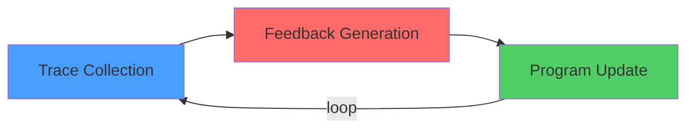

# 07 — Generative Feedback Loops

Demonstrates DSPy's core optimization mechanism: the Generative Feedback Loop (GFL).

> *"No gradients are computed. The LLM generates its own training signal—by proposing demonstrations, instructions, or self-reflections—and the metric provides the selection pressure."*



Covers:
- **BootstrapFewShot** — trace collection → metric evaluation → demo retention
- **GEPA** — reflective prompt mutation with Pareto-based selection (ICLR 2026 Oral)
- **MIPROv2** — joint optimization of instructions + few-shot demonstrations (EMNLP 2024)
- **Sequential GEPA → BootstrapFewShot** — chaining prompt evolution with demo bootstrapping
- **Teacher/Student distillation** — DeepSeek generates demos → Gemma 4 uses them

Each section runs the same task and compares performance before/after optimization.

## Prerequisites

```bash
uv sync

# For the teacher/student distillation step:
ollama pull gemma4
```

## Running

```bash
python lab/07-generative-feedback-loops/main.py
```
