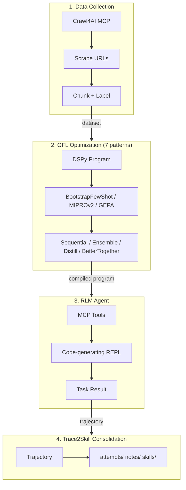
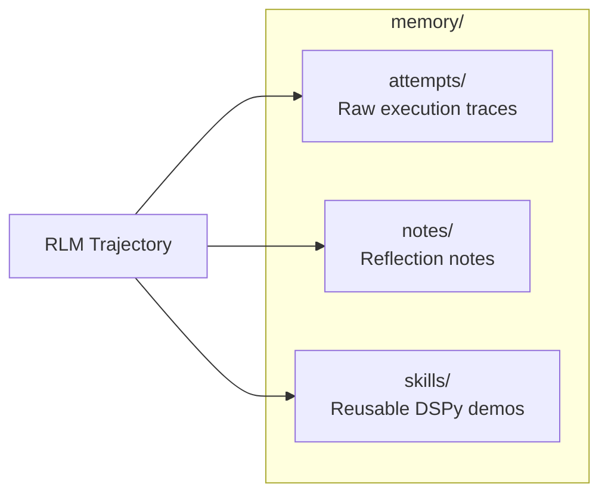

# 08 — Practical DSPy Patterns with MCP + RLM

End-to-end DSPy pipeline: scrape → optimize → agent → consolidate memory.

## Pipeline



## What it demonstrates

**Data-driven optimization** — no hardcoded data. The agent scrapes real web content via Crawl4AI MCP (`md` tool), builds a classification dataset on the fly, and optimizes against it. RLM execution trajectories are consolidated into reusable skills (Trace2Skill-style) with CORAL-inspired persistent memory across runs.

| Step | What happens |
|------|-------------|
| Scrape | URLs across docs, tutorials, source code |
| Chunk | Content split into paragraphs, labeled by source category |
| Optimize | 7 GFL patterns, ranked by improvement over baseline |
| Agent | RLM uses MCP tools for an open-ended research task |
| Consolidate | Trajectory saved as attempt + note + skill in `memory/` |

### Optimization Patterns

| Pattern | When to use | Optimizer |
|---|---|---|
| BootstrapFewShot | Simple cases, first try | `BootstrapFewShot` |
| MIPROv2 | Production pipelines | `MIPROv2 auto="light"` |
| GEPA | Hard tasks, cutting-edge | `GEPA` (ICLR 2026 Oral) |
| Sequential GEPA → BootstrapFewShot | Chaining prompt + demo opt | manual pipeline |
| Ensemble selection | Production robustness | train N, pick best |
| Teacher → Student distillation | Model compression | `BootstrapFewShot` with `teacher=` |
| BetterTogether meta-optimization | Multi-optimizer workflows | `BetterTogether` chains GEPA → MIPROv2 |

Optimizers are ranked by **improvement delta** over baseline, not just absolute accuracy.

### Memory Architecture (CORAL-style)



On each run, the RLM trajectory is saved as an attempt, a reflection note captures the outcome, and successful reasoning steps are extracted as reusable few-shot demonstrations. Previous skills are loaded at startup.

## Prerequisites

### Required — Crawl4AI Docker container

```bash
docker compose -f lab/08-rlm-mcp/docker-compose.yml up -d
```

### Optional — Ollama + Gemma 4 (teacher/student distillation)

```bash
ollama pull gemma4
```

## Running

```bash
python lab/08-rlm-mcp/main.py
```

The script:
1. Loads memory from previous runs (skills, attempt count)
2. Connects to Crawl4AI MCP and scrapes URLs
3. Runs all 7 optimization patterns, ranked by improvement
4. Launches an RLM agent for a synthesis task
5. Consolidates trajectory into `memory/` for future runs

## Scraped Sources

| URL | Category |
|-----|----------|
| `https://dspy.ai` | documentation |
| `https://docs.python.org/3/tutorial/index.html` | tutorial |
| `https://raw.githubusercontent.com/stanfordnlp/dspy/main/README.md` | documentation |
| `https://raw.githubusercontent.com/stanfordnlp/dspy/main/dspy/__init__.py` | source_code |

## Included MCP Servers

| Server | Type | Transport | Tools |
|--------|------|-----------|-------|
| `crawl4ai` | SSE | HTTP (`http://localhost:11235/mcp/sse`) | `md`, `html`, `screenshot`, `pdf`, `crawl`, `ask` |

## Customizing

Edit `mcp_server.json` to add more servers. Edit `SCRAPE_URLS` in `main.py` to change the data sources. Two transport types:

**stdio** — spawn a subprocess:
```json
{
  "mcpServers": {
    "my-server": {
      "type": "stdio",
      "command": "npx",
      "args": ["-y", "@org/mcp-server"],
      "env": { "API_KEY": "..." }
    }
  }
}
```

**SSE** — connect to an HTTP endpoint:
```json
{
  "mcpServers": {
    "my-server": {
      "type": "sse",
      "url": "http://host:port/mcp/sse"
    }
  }
}
```
