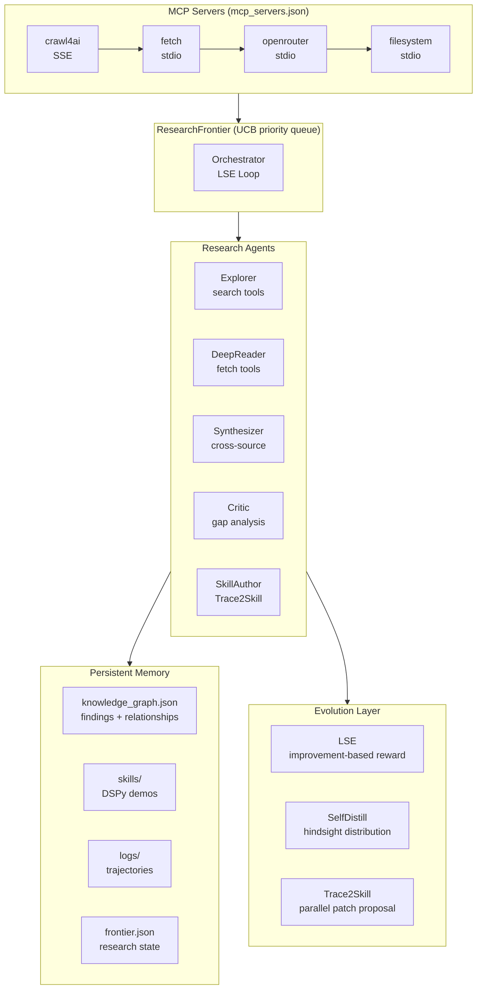

# 09 — Super Deep Research: Self-Evolving Agentic Platform

Multi-agent research platform with LSE meta-optimization, autonomous discovery, persistent knowledge graph, and collective intelligence via OpenRouter MCP.

## Architecture



## Prerequisites

```bash
# Crawl4AI
docker compose -f lab/09_super_deep_research/docker-compose.yml up -d

# OpenRouter MCP (requires Node.js 16+)
npx @physics91/openrouter-mcp init

# Set API keys in project root .env
# OPENROUTER_API_KEY=sk-or-...
# DEEPSEEK_API_KEY=...
```

## Running

```bash
# From project root:
python -m lab.09_super_deep_research.cli --query "your topic"
python -m lab.09_super_deep_research.cli --chat
python -m lab.09_super_deep_research.cli --status
```

## MCP Servers

| Server | Transport | Enabled | Tools |
|--------|-----------|---------|-------|
| `crawl4ai` | SSE | ✅ | `md`, `html`, `crawl`, `screenshot` |
| `fetch` | stdio | ✅ | `fetch` |
| `openrouter` | stdio | ❌ (opt-in) | `chat`, `model_list`, `consensus`, `ensemble`, `usage_stats` |
| `filesystem` | stdio | ✅ | `read`, `write`, `search` |

Toggle servers by setting `"enabled": false` in `config/mcp_servers.json`. Disabled servers are skipped at startup with a `[-]` log line.

## Key Patterns

- **LSE**: orchestrator strategy improves across runs via r = quality(c₁) − quality(c₀)
- **ResearchFrontier**: UCB-based topic selection for autonomous exploration
- **CORAL heartbeat**: periodic reflection + consolidation + stagnation redirection
- **Trace2Skill**: trajectories → parallel patches → conflict-free skill
- **Self-distillation**: SDPO-style conditioning on execution history
- **OpenRouter collective intelligence**: ensemble reasoning, cross-model validation
