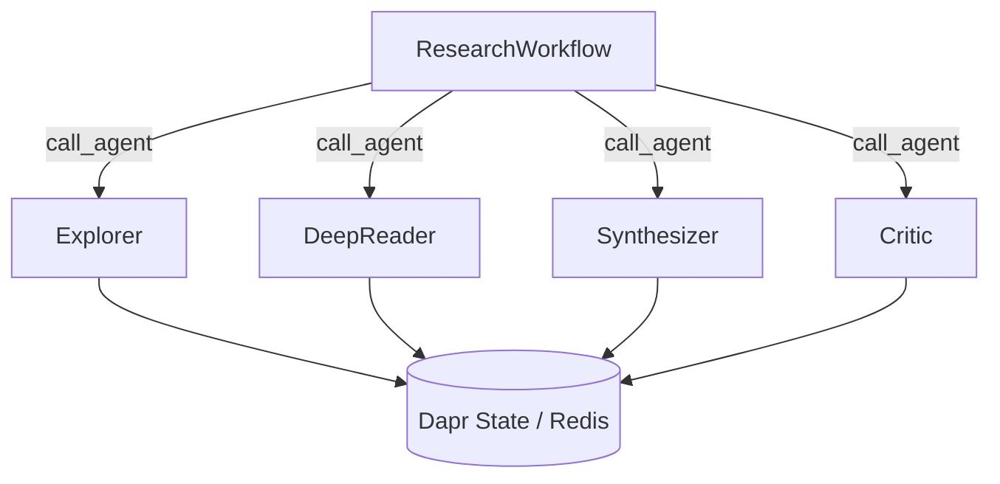

# 10 — Dapr Deep Research: Durable Agentic Research Platform

Multi-agent research platform combining **dapr-agents** (durable workflows, stateful execution) with **DSPy** (optimization, RLMs, GFL patterns).

## Architecture



Each agent is a `DurableAgent` subclass with a full DSPy pipeline inside:

| Agent | DSPy Modules |
|---|---|
| Explorer | `dspy.RLM` (discovery) + `dspy.ChainOfThought` (hypothesis gen) + `dspy.BestOfN` (top-k) + `BootstrapFewShot` (compile) |
| DeepReader | `dspy.RLM` (content extraction) + `dspy.ChainOfThought` (cross-validation) + `BootstrapFewShot` (compile) |
| Synthesizer | `dspy.RLM` (synthesis) + `dspy.ChainOfThought(SynthesizeAcrossSources)` + `BootstrapFewShot` (compile) |
| Critic | `dspy.RLM` (2-pass) + `dspy.Refine` (iterative improvement) + `dspy.MultiChainComparison` (3-chain compare) + `BootstrapFewShot` (compile) |
| Orchestrator | `dspy.ChainOfThought(SelectAgent)` + `dspy.ChainOfThought(ComputeConfidenceDelta)` + `BootstrapFewShot` (compile) |

All agents wrapped in `@workflow_entry` for durable execution with `DaprChatClient`,
`StateStoreService`, and automatic retry.

## DSPy + Dapr Integration

| Component | DSPy Implementation | Dapr Role |
|-----------|-------------------|-----------|
| Quality eval | `dspy.ChainOfThought(QualityEvaluation)` + `BootstrapFewShot` (compile) | State persisted in Redis |
| Pattern extraction | `dspy.ChainOfThought(ExtractPatterns)` + `BootstrapFewShot` (compile) | State persisted in Redis |
| Agent dispatch | `dspy.ChainOfThought(SelectAgent)` | `call_agent()` cross-app invocation |
| Agent reasoning | `dspy.RLM` + `dspy.CoT` + `dspy.BestOfN` + `dspy.Refine` + `dspy.MultiChainComparison` | `DurableAgent` shell + `@workflow_entry` |
| Agent optimization | `BootstrapFewShot.compile()` on all agents | `DaprFrontier` persistent state |
| Structured output | `BAMLAdapter` for Pydantic models | — |
| Confidence deltas | `dspy.ChainOfThought(ComputeConfidenceDelta)` per agent result | — |
| Saturation | `dspy.ChainOfThought(AssessDirectionSaturation)` per direction | — |
| Frontier | `ResearchDirection.ucb_score` (pure math) + DSPy saturation check | `DaprFrontier` via `StateStoreService` |
| Metrics | `dspy.Evaluate` | Workflow step checkpointing |

## References

- **LSE** (Chen et al., 2026): [Learning to Self-Evolve](https://arxiv.org/abs/2603.18620) — improvement-based reward `r = R̄(c₁) − R̄(c₀)` evaluated via `dspy.ChainOfThought`
- **Trace2Skill** (Ni et al., 2026): [Distill Trajectory-Local Lessons into Transferable Agent Skills](https://arxiv.org/abs/2603.25158) — parallel multi-agent patch proposal via `dspy.ChainOfThought`

## Configuration

All configuration is in the project root `.env` file:

```bash
# Required
DEEPSEEK_API_KEY="sk-..."

# LLM model selection
LLM_MODEL="deepseek/deepseek-v4-flash"        # Teacher / default LM
STUDENT_LLM_MODEL="ollama_chat/gemma4"        # Student LM for distillation
LLM_TEMPERATURE=0.3

# Infrastructure
CRAWL4AI_URL="http://localhost:11235/mcp/sse"
DAPR_REDIS_HOST="localhost:6379"
DAPR_STATE_STORE="research-state"
DAPR_PUBSUB="research-pubsub"
```

Copy `.env.example` from the project root to get started.

## Prerequisites

```bash
# Dapr
dapr init

# Crawl4AI
docker compose -f lab/10_dapr_deep_research/docker-compose.yml up -d

# Install deps
uv sync

# Optional — student model for distillation
ollama pull gemma4
```

## Running

Two paths depending on available infrastructure:

### Path A: Full distributed research (Dapr + Crawl4AI + Redis)

Requires `dapr init` completed and Docker running for Crawl4AI + Redis.

```bash
# Terminal 1: infrastructure
docker compose -f lab/10_dapr_deep_research/docker-compose.yml up -d

# Terminal 2: launch all 5 agents at once
dapr run -f lab/10_dapr_deep_research/dapr-multi-app-run.yaml
```

This starts the `ResearchWorkflow` orchestrator (port 8000) which:
1. Seeds a research query into the `DaprFrontier` (Redis-backed)
2. Each iteration selects the next direction via `SelectAgent` (DSPy CoT)
3. Dispatches `ExplorerAgent` (port 8001), `DeepReaderAgent` (8002), `SynthesizerAgent` (8003), or `CriticAgent` (8004) via `call_agent()`
4. Computes dynamic confidence deltas via `ComputeConfidenceDelta` (DSPy CoT)
5. Checkpoints progress to Redis every 3 iterations — survives crashes
6. Tracks LSE improvement trend across iterations

### Path B: Quick test (no infrastructure needed)

```bash
# Single-process UCB frontier demo (no Dapr, no Crawl4AI)
uv run python -m lab.10_dapr_deep_research --mode run

# Teacher/student distillation (requires Ollama + gemma4)
uv run python -m lab.10_dapr_deep_research --mode distill
```

The `--mode run` command exercises the UCB frontier loop in memory.
The `--mode distill` compiles every DSPy program using teacher (DeepSeek) → student (Gemma 4).

## CLI Reference

```text
usage: uv run python -m lab.10_dapr_deep_research [-h]
       [--mode {orchestrator,explorer,deepreader,synthesizer,critic,run,distill}]

modes:
  orchestrator  Start ResearchWorkflow on port 8000 (requires Dapr sidecar)
  explorer      Start ExplorerAgent on port 8001 (requires Dapr sidecar)
  deepreader    Start DeepReaderAgent on port 8002 (requires Dapr sidecar)
  synthesizer   Start SynthesizerAgent on port 8003 (requires Dapr sidecar)
  critic        Start CriticAgent on port 8004 (requires Dapr sidecar)
  run           UCB frontier loop demo (no infrastructure needed)
  distill       Teacher→Student compilation for all DSPy programs
```

## Key Features

- **Durable workflows**: Research survives process crashes — Dapr Workflows checkpoint after each iteration
- **Stateful frontier**: `DaprFrontier` uses Redis-backed state store, not JSON files
- **Multi-agent dispatch**: `call_agent()` for cross-agent workflow orchestration
- **DSPy-driven confidence**: Hardcoded confidence deltas (0.3, 0.2, 0.15) replaced with `ComputeConfidenceDelta` signature — delta adapts to finding quality
- **DSPy-driven saturation**: Static 0.95 threshold replaced with `AssessDirectionSaturation` — per-direction assessment
- **MultiChainComparison**: CriticAgent compares 3 critique chains via `dspy.MultiChainComparison` before refinement
- **Universal compilation**: Every DSPy program (`DeepReader`, `Synthesizer`, `Critic`, `LSE`, `Trace2Skill`, `Orchestrator`) has a `compile()` method ready for `BootstrapFewShot`
- **LSE meta-optimization**: Improvement-based reward trains the orchestrator across runs
- **Pub/sub coordination**: `research-pubsub` topic for agent broadcasts
- **Parallel tool execution**: `ToolExecutionMode.PARALLEL` for MCP tool calls
