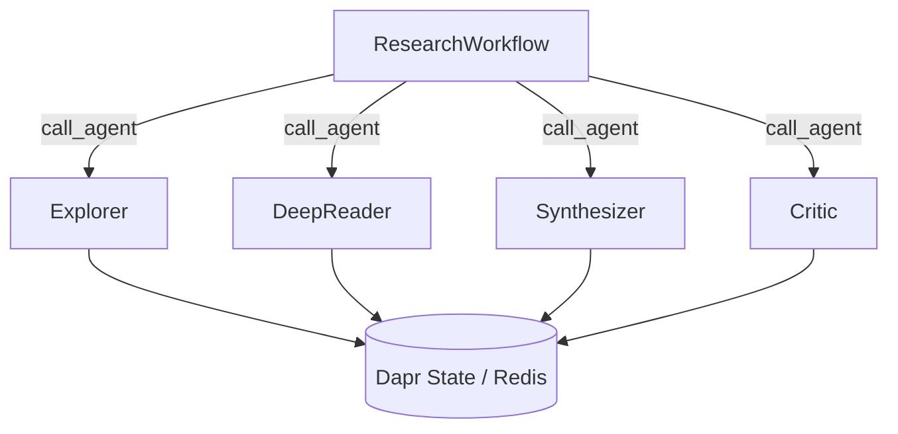

# 10 — Dapr Deep Research: Durable Agentic Research Platform

Multi-agent research platform combining **dapr-agents** (durable workflows, stateful execution) with **DSPy** (optimization, RLMs, GFL patterns).

## Architecture



Each agent is a `DurableAgent` subclass with a full DSPy pipeline inside:

| Agent | DSPy Modules |
|---|---|
| Explorer | `dspy.RLM` (discovery) + `dspy.ChainOfThought` (hypothesis gen) + `dspy.BestOfN` (diverse sampling) |
| DeepReader | `dspy.RLM` (content extraction) + `dspy.ChainOfThought` (cross-validation) |
| Synthesizer | `dspy.RLM` (synthesis) + `dspy.Ensemble` (multi-perspective) |
| Critic | `dspy.RLM` (critique) + `dspy.Refine` (iterative improvement) |

All agents wrapped in `@workflow_entry` for durable execution with `DaprChatClient`,
`StateStoreService`, and automatic retry.

## DSPy + Dapr Integration

| Component | DSPy Implementation | Dapr Role |
|-----------|-------------------|-----------|
| Quality eval | `dspy.ChainOfThought(QualityEvaluation)` | State persisted in Redis |
| Pattern extraction | `dspy.ChainOfThought(ExtractPatterns)` | State persisted in Redis |
| Agent reasoning | `dspy.RLM` + `dspy.CoT` + `dspy.BestOfN` + `dspy.Ensemble` + `dspy.Refine` | `DurableAgent` shell + `call_agent()` dispatch |
| Frontier | `ResearchDirection.ucb_score` (pure math) | `DaprFrontier` via `StateStoreService` |
| Metrics | `dspy.Evaluate` | Workflow step checkpointing |

## References

- **LSE** (Chen et al., 2026): [Learning to Self-Evolve](https://arxiv.org/abs/2603.18620) — improvement-based reward `r = R̄(c₁) − R̄(c₀)` evaluated via `dspy.ChainOfThought`
- **Trace2Skill** (Ni et al., 2026): [Distill Trajectory-Local Lessons into Transferable Agent Skills](https://arxiv.org/abs/2603.25158) — parallel multi-agent patch proposal via `dspy.ChainOfThought`

## Prerequisites

```bash
# Dapr
dapr init

# Crawl4AI
docker compose -f lab/10_dapr_deep_research/docker-compose.yml up -d

# Install deps
uv sync
```

## Running

### Multi-app run (all 5 agents at once, from project root):

```bash
dapr run -f lab/10_dapr_deep_research/dapr-multi-app-run.yaml
```

Launches orchestrator (8000), explorer (8001), deepreader (8002), synthesizer (8003), critic (8004) with shared Redis state store and pub/sub.

### Individual agents (separate terminals, from project root):

```bash
dapr run --app-id orchestrator --app-protocol grpc --app-port 8000 \
    --resources-path lab/10_dapr_deep_research/resources -- \
    python -m lab.10_dapr_deep_research --mode orchestrator

dapr run --app-id explorer-agent --app-protocol grpc --app-port 8001 \
    --resources-path lab/10_dapr_deep_research/resources -- \
    python -m lab.10_dapr_deep_research --mode explorer
```

### Programmatic (no Dapr sidecar, single process):

```bash
python -m lab.10_dapr_deep_research --mode run
```

## Key Features

- **Durable workflows**: Research survives process crashes — Dapr Workflows checkpoint after each iteration
- **Stateful frontier**: `DaprFrontier` uses Redis-backed state store, not JSON files
- **Multi-agent dispatch**: `call_agent()` for cross-agent workflow orchestration
- **DSPy optimization**: Full GFL pipeline runs inside workflow steps
- **LSE meta-optimization**: Improvement-based reward trains the orchestrator across runs
- **Pub/sub coordination**: `research-pubsub` topic for agent broadcasts
- **Parallel tool execution**: `ToolExecutionMode.PARALLEL` for MCP tool calls
- **Hot-reload config**: `RuntimeSubscriptionConfig` for live agent persona changes
