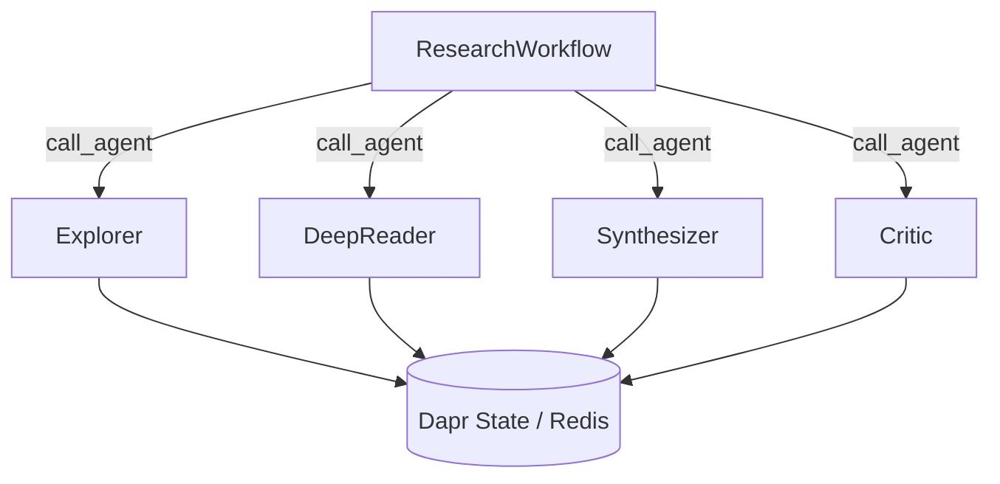

# 10 — Dapr Deep Research: Durable Agentic Research Platform

Multi-agent research platform combining **dapr-agents** (durable workflows, stateful execution) with **DSPy** (optimization, RLMs, GFL patterns).

## Architecture



Each agent is a `DurableAgent` subclass with a full DSPy pipeline inside:

| Agent | DSPy Modules |
|---|---|
| Explorer | `dspy.RLM` (discovery) + `dspy.ChainOfThought` (hypothesis gen) + `dspy.BestOfN` (top-k) + `BootstrapFewShot` (compile) |
| DeepReader | `dspy.RLM` (content extraction) + `dspy.ChainOfThought` (cross-validation) + `BootstrapFewShot` (compile) |
| Synthesizer | `dspy.RLM` (synthesis) + `dspy.ChainOfThought(SynthesizeAcrossSources)` + `BootstrapFewShot` (compile) |
| Critic | `dspy.RLM` (2-pass) + `dspy.Refine` (iterative improvement) + `dspy.MultiChainComparison` (3-chain compare) + `BootstrapFewShot` (compile) |
| Orchestrator | `dspy.ChainOfThought(SelectAgent)` + `dspy.ChainOfThought(ComputeConfidenceDelta)` + `BootstrapFewShot` (compile) |

All agents wrapped in `@workflow_entry` for durable execution with `DaprChatClient`,
`StateStoreService`, and automatic retry.

**Shared primitives** in `lab/shared/research.py`:
- `ResearchDirection` — single dataclass used by both `InMemoryFrontier` and `DaprFrontier`
- `ResearchFrontier` ABC — defines the interface (seed, absorb, next_action, saturated)
- `SATURATION_THRESHOLD`, `MAX_BOOTSTRAPPED_DEMOS`, `MAX_LABELED_DEMOS` — shared constants
- `get_dapr_state_store()`, `get_lm_temperature()` in `lab/shared/config.py`

## DSPy + Dapr Integration

| Component | DSPy Implementation | Dapr Role |
|-----------|-------------------|-----------|
| Quality eval | `dspy.ChainOfThought(QualityEvaluation)` + `BootstrapFewShot` (compile) | State persisted in Redis |
| Pattern extraction | `dspy.ChainOfThought(ExtractPatterns)` + `BootstrapFewShot` (compile) | State persisted in Redis |
| Agent dispatch | `dspy.ChainOfThought(SelectAgent)` | `call_agent()` cross-app invocation |
| Agent reasoning | `dspy.RLM` + `dspy.CoT` + `dspy.BestOfN` + `dspy.Refine` + `dspy.MultiChainComparison` | `DurableAgent` shell + `@workflow_entry` |
| Agent optimization | `BootstrapFewShot.compile()` on all agents | `DaprFrontier` persistent state |
| Structured output | `BAMLAdapter` for Pydantic models | — |
| Confidence deltas | `dspy.ChainOfThought(ComputeConfidenceDelta)` per agent result | — |
| Saturation | `dspy.ChainOfThought(AssessBatchSaturation)` — single batch call | — |
| Frontier | `ResearchDirection.ucb_score` (pure math) + `AssessBatchSaturation` | `DaprFrontier` via `StateStoreService` |
| No-infra state | `NoopStore` (in-memory `StateStoreService` subclass) | — |
| Metrics | `dspy.Evaluate` | Workflow step checkpointing |

## References

- **LSE** (Chen et al., 2026): [Learning to Self-Evolve](https://arxiv.org/abs/2603.18620) — improvement-based reward `r = R̄(c₁) − R̄(c₀)` evaluated via `dspy.ChainOfThought`
- **Trace2Skill** (Ni et al., 2026): [Distill Trajectory-Local Lessons into Transferable Agent Skills](https://arxiv.org/abs/2603.25158) — parallel multi-agent patch proposal via `dspy.ChainOfThought`

## Configuration

All configuration is in the project root `.env` file:

```bash
# Required
DEEPSEEK_API_KEY="sk-..."

# LLM model selection
LLM_MODEL="deepseek/deepseek-v4-flash"        # Teacher / default LM
STUDENT_LLM_MODEL="ollama_chat/gemma4"        # Student LM for distillation
LLM_TEMPERATURE=0.3

# Infrastructure
CRAWL4AI_URL="http://localhost:11235/mcp/sse"
DAPR_REDIS_HOST="localhost:6379"
DAPR_STATE_STORE="research-state"
DAPR_PUBSUB="research-pubsub"
```

Copy `.env.example` from the project root to get started.

## Quick Setup

```bash
# One command — installs deps, starts Docker infra, initializes Dapr:
./setup.sh

# Or step by step:
uv sync                          # Install Python deps
docker compose -f lab/10_dapr_deep_research/docker-compose.yml up -d  # Crawl4AI
dapr init                        # Dapr control plane
ollama pull gemma4               # Student model for distillation (optional)
```

## Running

After `./setup.sh` (or manually satisfying prerequisites), two paths depending on available infrastructure:

### Path A: Full distributed research (Dapr + Crawl4AI + Redis)

Requires `dapr init` completed and Docker running for Crawl4AI + Redis.

```bash
# Terminal 1: infrastructure
docker compose -f lab/10_dapr_deep_research/docker-compose.yml up -d

# Terminal 2: launch all 5 agents at once
dapr run -f lab/10_dapr_deep_research/dapr-multi-app-run.yaml
```

This starts the `ResearchWorkflow` orchestrator (port 8000) which:
1. Seeds a research query into the `DaprFrontier` (Redis-backed)
2. Each iteration selects the next direction via `SelectAgent` (DSPy CoT)
3. Dispatches `ExplorerAgent` (port 8001), `DeepReaderAgent` (8002), `SynthesizerAgent` (8003), or `CriticAgent` (8004) via `call_agent()`
4. Computes dynamic confidence deltas via `ComputeConfidenceDelta` (DSPy CoT)
5. Checkpoints progress to Redis every 3 iterations — survives crashes
6. Tracks LSE improvement trend across iterations

### Path B: No-infrastructure commands (no Dapr, no Docker needed)

The `_NoopStore` and `InMemoryFrontier` classes allow all agents to run
without the Dapr sidecar. Agents use direct `dspy.LM` calls instead of
`DaprChatClient`.

```bash
# Agent selection demo with Rich table output
uv run python -m lab.10_dapr_deep_research --query "Transformers" run

# Full pipeline: MCP scrape → GFL compile → LSE research loop
uv run python -m lab.10_dapr_deep_research --query "DSPy optimization" --iterations 10 mission

# Teacher/student distillation (requires Ollama + gemma4)
uv run python -m lab.10_dapr_deep_research distill

# Help for any command
uv run python -m lab.10_dapr_deep_research mission --help
```

## CLI Reference

The CLI uses [Click](https://click.palletsprojects.com/) with subcommands
and [Rich](https://rich.readthedocs.io/) for terminal output.

```text
Usage: uv run python -m lab.10_dapr_deep_research [OPTIONS] COMMAND [ARGS]...

Global options:
  -q, --query TEXT          Research topic or question
  -i, --iterations INTEGER  Max research iterations  [default: 5]

Commands:
  orchestrator  Start ResearchWorkflow on port 8000 (requires Dapr sidecar)
  explorer      Start ExplorerAgent on port 8001 (Dapr + Crawl4AI)
  deepreader    Start DeepReaderAgent on port 8002 (Dapr + Crawl4AI)
  synthesizer   Start SynthesizerAgent on port 8003 (Dapr sidecar)
  critic        Start CriticAgent on port 8004 (Dapr sidecar)
  chat          Interactive research REPL (no infrastructure)
  run           Agent selection demo (no infrastructure)
  mission       Full pipeline: MCP → GFL → LSE (no infrastructure)
  distill       Teacher→Student compilation for all DSPy programs
```

### CLI examples

```bash
# Global options go BEFORE the subcommand:
uv run python -m lab.10_dapr_deep_research --query "topic" --iterations 8 run

# Start a Dapr-wrapped agent server:
dapr run --app-id explorer-agent --app-protocol grpc --app-port 8001 \
    --resources-path lab/10_dapr_deep_research/resources -- \
    uv run python -m lab.10_dapr_deep_research explorer

# Multi-app Dapr launch (all 5 agents):
dapr run -f lab/10_dapr_deep_research/dapr-multi-app-run.yaml
```

## Key Features

- **Durable workflows**: Research survives process crashes — Dapr Workflows checkpoint after each iteration
- **Stateful frontier**: `DaprFrontier` uses Redis-backed state store, not JSON files
- **No-infrastructure mode**: `InMemoryFrontier` + `NoopStore` let all agents run without Dapr for development
- **Shared primitives**: `ResearchDirection`, `ResearchFrontier` ABC, and compile constants in `lab/shared/research.py` — no more duplicate dataclasses
- **Dict-based frontier**: Both frontiers use `dict[str, ResearchDirection]` for O(1) lookups instead of O(n) list scans
- **Correct active counts**: `_active_count()` computed from actual data instead of a broken increment-only cache
- **Saturation cache**: `DaprFrontier` caches `_saturated_indices` and invalidates only on mutations — avoids an LLM call per `next_action()`
- **Batch saturation**: `AssessBatchSaturation` replaces N+1 per-direction LLM calls with a single batch call
- **Factory pattern**: `_create_agents()` eliminates repeated agent construction across all commands
- **Dynamic agent commands**: `_make_dapr_cmd()` generates explorer/deepreader/synthesizer/critic from a single pattern
- **Cached frontier counts**: `_active_count` tracks active/explored in O(1) instead of O(n) per summary
- **Click CLI**: Command-based interface with `--query` and `--iterations` global options
- **Rich output**: Tables and panels for research loop results and mission summaries
- **Multi-agent dispatch**: `call_agent()` for cross-agent workflow orchestration
- **DSPy-driven confidence**: Hardcoded confidence deltas replaced with `ComputeConfidenceDelta` signature — delta adapts to finding quality
- **MultiChainComparison**: CriticAgent compares 3 critique chains via `dspy.MultiChainComparison` before refinement
- **Universal compilation**: Every DSPy program has a `compile()` method with shared constants
- **LSE meta-optimization**: Improvement-based reward (`QualityEvaluation` via `dspy.ChainOfThought`) trains the orchestrator across runs
- **Trace2Skill integration**: SkillConsolidator receives real trajectory data from LSE runs in `mission` command
- **Wired config**: `get_lm_temperature()` used in all LM creation; `get_dapr_state_store()` replaces hardcoded `"research-state"` across 4 modules
- **Pub/sub coordination**: `research-pubsub` topic for agent broadcasts
- **Parallel tool execution**: `ToolExecutionMode.PARALLEL` for MCP tool calls
