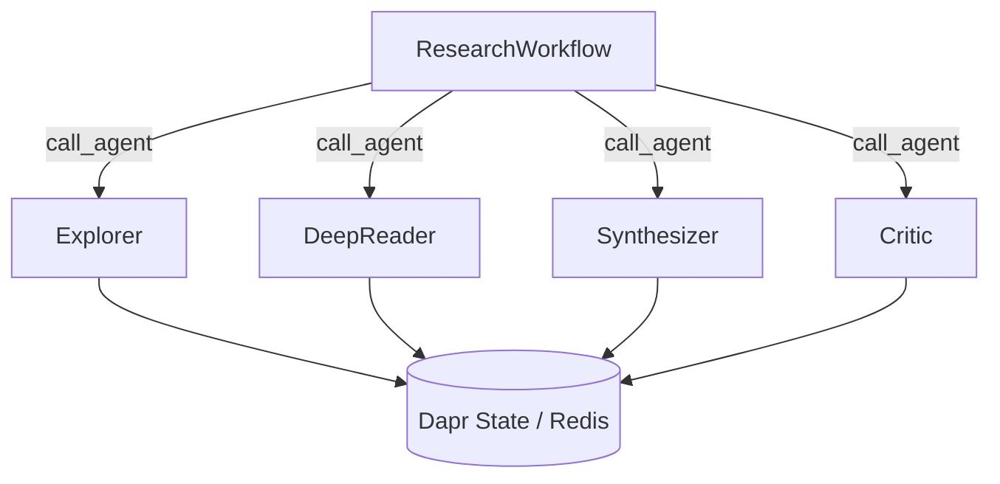

# 10 — Dapr Deep Research: Durable Agentic Research Platform

Multi-agent research platform combining **dapr-agents** (durable workflows, stateful execution) with **DSPy** (optimization, RLMs, GFL patterns).

## Architecture



Each agent is a `DurableAgent` subclass with:
- `@workflow_entry` — workflow-backed execution with automatic retry
- `DaprChatClient` — LLM access via Dapr Conversation API
- `StateStoreService` — persistent state across crashes
- Internal `dspy.RLM` — DSPy's recursive LM for the actual AI work

## DSPy Integration

| Component | DSPy Code | Dapr Role |
|-----------|-----------|-----------|
| Research RLMs | `dspy.RLM(signature, tools=tools)` | `DurableAgent` shell with workflow durability |
| Optimization | `BootstrapFewShot`, `MIPROv2`, `GEPA`, `BetterTogether` | Workflow steps with checkpoint/restart |
| Frontier | `ResearchFrontier` (UCB priority) | `DaprFrontier` backed by `StateStoreService` |
| LSE | `LSEOptimizer` (improvement-based reward) | State persisted in Dapr state store |
| Trace2Skill | `SkillConsolidator` | State persisted in Dapr state store |
| Metrics | `dspy.Evaluate`, custom metrics | Workflow step evaluation |

## Prerequisites

```bash
# Dapr
dapr init

# Crawl4AI
docker compose -f lab/10_dapr_deep_research/docker-compose.yml up -d

# Install deps
uv sync
```

## Running

### Multi-app run (all 5 agents at once, from project root):

```bash
dapr run -f lab/10_dapr_deep_research/dapr-multi-app-run.yaml
```

Launches orchestrator (8000), explorer (8001), deepreader (8002), synthesizer (8003), critic (8004) with shared Redis state store and pub/sub.

### Individual agents (separate terminals, from project root):

```bash
dapr run --app-id orchestrator --app-protocol grpc --app-port 8000 \
    --resources-path lab/10_dapr_deep_research/resources -- \
    python -m lab.10_dapr_deep_research --mode orchestrator

dapr run --app-id explorer-agent --app-protocol grpc --app-port 8001 \
    --resources-path lab/10_dapr_deep_research/resources -- \
    python -m lab.10_dapr_deep_research --mode explorer
```

### Programmatic (no Dapr sidecar, single process):

```bash
python -m lab.10_dapr_deep_research --mode run
```

## Key Features

- **Durable workflows**: Research survives process crashes — Dapr Workflows checkpoint after each iteration
- **Stateful frontier**: `DaprFrontier` uses Redis-backed state store, not JSON files
- **Multi-agent dispatch**: `call_agent()` for cross-agent workflow orchestration
- **DSPy optimization**: Full GFL pipeline runs inside workflow steps
- **LSE meta-optimization**: Improvement-based reward trains the orchestrator across runs
- **Pub/sub coordination**: `research-pubsub` topic for agent broadcasts
- **Parallel tool execution**: `ToolExecutionMode.PARALLEL` for MCP tool calls
- **Hot-reload config**: `RuntimeSubscriptionConfig` for live agent persona changes
