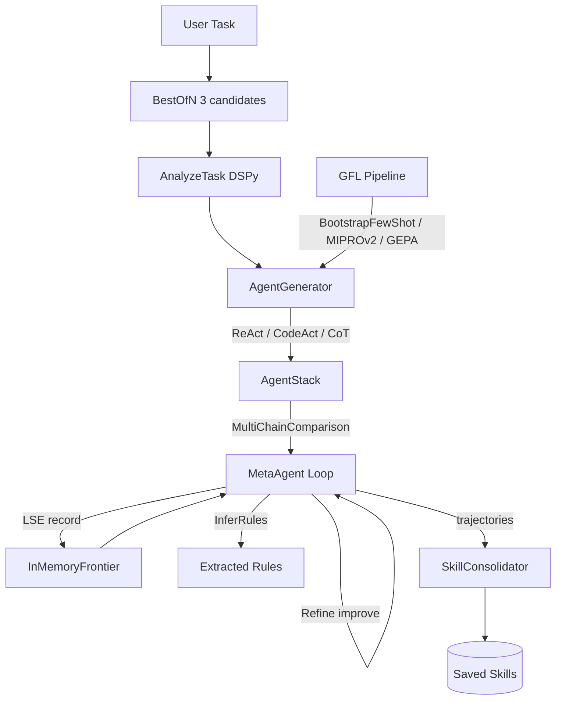

# 11 — Meta-Agent: Dynamic Agent Generation with DSPy 3.2

Generates specialized DSPy agents **on the fly** using GFL (Generative Feedback Loops),
LSE (Learning to Self-Evolve), and Trace2Skill for pattern consolidation.

Instead of hardcoded agents, the meta-agent analyzes the task, generates agent
definitions (ReAct, CodeAct, or ChainOfThought), optimizes them via GFL, runs
them through an LSE-optimized loop with MultiChainComparison, and consolidates
patterns into reusable skills.

## DSPy Features Used

| Module | Usage |
|--------|-------|
| `dspy.ChainOfThought` | Task analysis, quality evaluation, rule extraction |
| `dspy.ReAct` | Tool-using generated agents (max_iters=10) |
| `dspy.CodeAct` | Code-capable agents with tool integration |
| `dspy.BestOfN` | Sample 3 task analyses, pick best by agent count |
| `dspy.MultiChainComparison` | Compare 3 candidate agents for selection |
| `dspy.Refine` | Iterative prompt improvement (N=3) |
| `dspy.Ensemble` | Multiple prediction aggregation |
| `dspy.BootstrapFewShot` | Trace -> demo pipeline (GFL) |
| `dspy.MIPROv2` | Instruction + demo Bayesian optimization (GFL) |
| `dspy.GEPA` | Reflective prompt evolution via Pareto frontier (GFL) |
| `dspy.Evaluate` | Program evaluation harness |
| `dspy.Signature` + `BAMLAdapter` | Dynamic signature subclass creation via `type()` |
| `dspy.InferRules` | Rule induction from execution trajectories |

## Architecture



```
11_meta_agent/
├── cli.py                        # Click CLI: 6 commands
├── meta/
│   ├── agent_stack.py            # AgentEntry + AgentStack
│   ├── agent_generator.py        # BestOfN + ReAct + CodeAct generation
│   └── meta_agent.py             # MultiChainComparison + Refine + InferRules
├── evolution/
│   ├── gfl.py                    # GFL pipeline (BootstrapFewShot, MIPROv2, GEPA, Sequential)
│   ├── lse.py                    # LSEOptimizer (from lab 10)
│   └── trace2skill.py            # SkillConsolidator (from lab 10)
├── memory/                       # InMemoryFrontier, NoopStore (from lab 10)
├── mcp/                          # MCPClient, MCPBridge (from lab 10)
└── config/
    └── mcp_servers.json          # MCP server definitions
```

## CLI Commands

```bash
uv run python -m lab.11_meta_agent [OPTIONS] COMMAND [ARGS]...

Options:
  -q, --query TEXT          Task description
  -i, --iterations INTEGER  Max iterations  [default: 5]
  --help                    Show this message and exit.

Commands:
  generate  Analyze task and generate agents onto the stack
  run       Full pipeline: generate -> run stack -> LSE -> consolidate
  optimize  Optimize generated agents via GEPA
  gfl       Run full GFL pipeline (BootstrapFewShot, MIPROv2, GEPA)
  stack     Inspect agent stack
  distill   Teacher -> student compilation
```

### Examples

```bash
# Generate agents using BestOfN analysis
uv run python -m lab.11_meta_agent \
  --query "Build a RAG pipeline with DSPy" generate

# Full pipeline: generate -> run -> LSE -> consolidate
uv run python -m lab.11_meta_agent \
  --query "Compare attention mechanisms" --iterations 10 run

# GFL optimization (BootstrapFewShot + MIPROv2 + GEPA)
uv run python -m lab.11_meta_agent \
  --query "Classify user intent" gfl

# GEPA prompt evolution for generated agents
uv run python -m lab.11_meta_agent \
  --query "Research transformers" optimize

# Distill to student model
uv run python -m lab.11_meta_agent distill
```

## How the GFL Pipeline Works

The pipeline in `evolution/gfl.py` runs all optimizers and compares results:

1. **Baseline**: no optimization
2. **BootstrapFewShot**: trace -> keep passing demos -> attach to program
3. **MIPROv2**: bootstrap demos -> propose instruction variants -> Bayesian search
4. **GEPA**: execute -> read traces -> diagnose failures -> mutate instructions -> Pareto select
5. **Sequential**: GEPA (prompts) -> BootstrapFewShot (demos)

References: [GFL blog post](https://octagono.org/blog/dspy-generative-feedback-loops/),
[lab 07](../../07-generative-feedback-loops/)

## Key Differences from lab 10

| Aspect | 10_dapr_deep_research | 11_meta_agent |
|--------|----------------------|---------------|
| Agents | Fixed Explorer/DeepReader/Synthesizer/Critic | **Generated on the fly** via BestOfN |
| Agent types | DurableAgent subclasses | ReAct (tools), CodeAct, or ChainOfThought |
| Selection | Hardcoded `if/elif` | **MultiChainComparison** (3 candidates) |
| Optimization | BootstrapFewShot only | **GFL pipeline**: BootstrapFewShot, MIPROv2, GEPA, Sequential |
| Adaptation | Manual code changes | Dynamic via **Refine** + InferRules |
| Task analysis | None (agents predefined) | **BestOfN** over 3 candidate analyses |
| Infrastructure | Dapr + Redis + Docker | **Pure DSPy** (NoopStore, no Dapr) |
| Signatures | Static classes | Dynamic `type()` subclasses via BAMLAdapter |

## References

- **GFL**: [DSPy Generative Feedback Loops](https://octagono.org/blog/dspy-generative-feedback-loops/)
- **LSE** — Chen et al., 2026: [Learning to Self-Evolve](https://arxiv.org/abs/2603.18620)
- **Trace2Skill** — Ni et al., 2026: [Distill Trajectory-Local Lessons](https://arxiv.org/abs/2603.25158)
