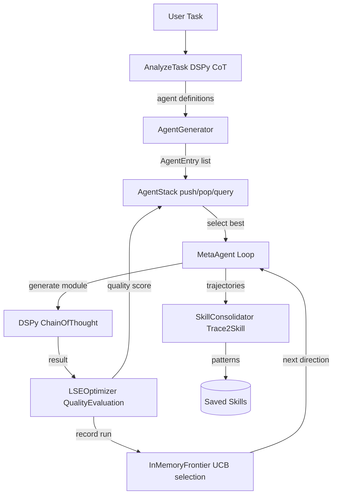

# 11 — Meta-Agent: Dynamic Agent Generation with LSE + Trace2Skill

Generates specialized DSPy agents **on the fly** using LSE (Learning to Self-Evolve)
for iterative improvement and Trace2Skill for pattern consolidation.

Instead of hardcoded agents (fixed Explorer/DeepReader/Synthesizer/Critic), the
meta-agent analyzes the task, generates agent definitions via DSPy ChainOfThought,
runs them through an LSE-optimized loop, and consolidates what it learns into
reusable skills.

## Architecture



```
11_meta_agent/
├── cli.py                        # Click CLI: generate, run, stack, distill
├── meta/
│   ├── agent_stack.py            # AgentEntry + AgentStack (push/pop/query by role/goal)
│   ├── agent_generator.py        # AnalyzeTask + GenerateSignature DSPy signatures
│   └── meta_agent.py             # MetaAgent orchestrator (LSE + Stack + Trace2Skill)
├── evolution/                    # From lab 10: LSEOptimizer, SkillConsolidator
├── memory/                       # From lab 10: InMemoryFrontier, NoopStore
├── mcp/                          # From lab 10: MCPClient, MCPBridge
└── config/
    └── mcp_servers.json          # MCP server definitions (crawl4ai, fetch)
```

## How It Works

### 1. Task Analysis

```
Input: "Research transformer attention mechanisms"

AnalyzeTask DSPy CoT → 3 agents needed:
  - searcher:     "Search papers about transformer attention"
  - analyzer:     "Extract key insights from papers"
  - synthesizer:  "Synthesize findings into a coherent report"
```

### 2. Signature Generation

For each agent definition, `GenerateSignature` creates a DSPy-compatible signature:

```
searcher:     query: str -> findings: str
analyzer:     content: str -> insights: str, gaps: str
synthesizer:  findings: str -> report: str, key_points: list[str]
```

### 3. Execution Loop

```
1. Frontier selects next direction (UCB score)
2. SelectNextAgent picks best agent from stack
3. AgentGenerator.generate_module() creates a dspy.ChainOfThought
4. Module executes → LSE records quality score
5. Frontier absorbs findings (confidence update)
6. Repeat until saturated or iterations exhausted
```

### 4. Consolidation

All trajectories are fed to SkillConsolidator (Trace2Skill), which extracts
error patterns and success patterns via `dspy.ChainOfThought(ExtractPatterns)`.
The resulting patterns are saved as a named skill.

## Key Difference from lab 10

| Aspect | 10_dapr_deep_research | 11_meta_agent |
|--------|----------------------|---------------|
| Agents | Explorer, DeepReader, Synthesizer, Critic | **Generated on the fly** per task |
| Agent definition | Fixed `DurableAgent` subclass | `AgentEntry` dataclass (name, role, goal, signature, tools) |
| Selection | Hardcoded `if/elif` dispatch | `SelectNextAgent` DSPy ChainOfThought |
| Adaptation | Manual code changes | Dynamic via **`GenerateSignature`** DSPy module |
| Infrastructure | Dapr + Redis + Docker | **Pure DSPy** (NoopStore, no Dapr) |

## CLI Reference

```bash
# Global options
uv run python -m lab.11_meta_agent [OPTIONS] COMMAND [ARGS]...

Options:
  -q, --query TEXT          Task description
  -i, --iterations INTEGER  Max research iterations  [default: 5]
  --help                    Show this message and exit.

Commands:
  generate  Analyze task and generate agents onto the stack
  run       Full pipeline: generate → run stack → LSE → consolidate
  stack     Inspect current agent stack
  distill   Teacher → student compilation for generated agents
```

### Examples

```bash
# Generate + inspect agents for a task
uv run python -m lab.11_meta_agent \
  --query "Build a RAG pipeline with DSPy and ColBERTv2" generate

# Full meta-agent pipeline with 10 iterations
uv run python -m lab.11_meta_agent \
  --query "Compare attention mechanisms in transformers" \
  --iterations 10 run

# Check what agents are on the stack
uv run python -m lab.11_meta_agent stack

# Distill generated agents to a smaller model
uv run python -m lab.11_meta_agent distill
```

## Core Components

### `meta/agent_stack.py`

- **`AgentEntry`**: dataclass with `name`, `role`, `goal`, `signature` (DSPy field spec),
  `tools` (MCP tool names), `run_count`, `avg_quality`
- **`AgentStack`**: push/pop/peek registry with query by role/goal, run tracking

### `meta/agent_generator.py`

- **`AnalyzeTask`**: DSPy signature — determines how many and what kind of agents
- **`GenerateSignature`**: DSPy signature — generates DSPy-compatible field spec
- **`AgentGenerator`**: orchestrates analysis, creates `AgentEntry` objects,
  builds `dspy.Module` instances with `dspy.ChainOfThought`

### `meta/meta_agent.py`

- **`SelectNextAgent`**: DSPy signature — picks best agent from stack for current task
- **`MetaAgent`**: orchestrates the full loop:
  `generate → stack → frontier → select → execute → LSE → consolidate`

## References

- **LSE** — Chen et al., 2026: [Learning to Self-Evolve](https://arxiv.org/abs/2603.18620)
- **Trace2Skill** — Ni et al., 2026: [Distill Trajectory-Local Lessons](https://arxiv.org/abs/2603.25158)
