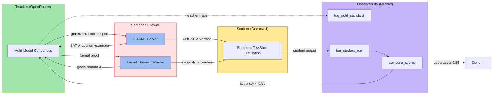

# 12 — Formal Evolution: Verified Multi-Model Consensus

**Extension of lab 11** adding 7 MCP servers for formal verification (Z3, Lean4),
multi-model consensus (OpenRouter), research (arXiv), observability (MLflow),
filesystem access, and Git operations — all auto-discovered by the meta-agent
via the MCP bridge.

Zero code changes. Add any MCP server to `config/mcp_servers.json` and the agent
finds its tools automatically.

## MCP Servers

| Server | Transport | Enabled | Tools | Purpose |
|--------|-----------|---------|-------|---------|
| `crawl4ai` | SSE | ✅ | `md`, `html`, `crawl`, `screenshot` | Deep web scraping |
| `fetch` | stdio | ✅ | `fetch` | URL fetching |
| `openrouter` | stdio | ✅ | `chat_completion`, `model_list`, `consensus`, `ensemble`, `usage_stats` | 100+ models for cross-validation |
| `z3-solver` | stdio | ✅ | `solve_constraint_problem`, `simple_constraint_solver`, `analyze_relationships`, `simple_relationship_analyzer` | SMT solving, property verification |
| `arxiv` | stdio | ✅ | `search_papers`, `download_paper`, `read_paper`, `list_papers`, `semantic_search`, `citation_graph` | Paper search & analysis |
| `lean-lsp` | stdio | ❌ | `lean_goal`, `lean_build`, `lean_diagnostic_messages`, `lean_run_code`, `lean_leansearch`, 20+ more | Theorem proving |
| `filesystem` | stdio | ❌ | `read_file`, `write_file`, `edit_file`, `search_files`, `directory_tree`, `list_directory` | Local file access |
| `git` | stdio | ❌ | `git_status`, `git_diff`, `git_log`, `git_commit`, `git_branch`, `git_checkout` | Git operations |
| `mlflow` | stdio | ❌ | `search_traces`, `get_trace`, `log_feedback`, `log_expectation`, `set_trace_tag`, `delete_traces` | LLM trace observability & evaluation |

Toggle any server via `"enabled": false` — disabled servers are skipped at startup.

## Architecture

```
12_formal_evolution/
├── cli.py                    # Same CLI: generate, run, optimize, gfl, stack, distill
├── meta/                     # Agent generation + meta-agent loop
├── evolution/                # GFL pipeline (BootstrapFewShot, MIPROv2, GEPA)
├── memory/                   # InMemoryFrontier + NoopStore
├── mcp/                      # MCPClient + MCPBridge (from lab 11)
├── z3_mcp/                   # Cloned Z3 MCP server (javergar/z3_mcp)
└── config/
    └── mcp_servers.json      # All 9 MCP servers configured
```

## How It Works

No new code. The meta-agent workflow is unchanged from lab 11:

1. **Analyze**: `BestOfN` samples 3 task analyses, picks best by agent count
2. **Generate**: Creates RLM/ReAct/CodeAct/CoT agents with relevant tools
3. **Run**: Agents discover all connected MCP server tools via the bridge
4. **Evolve**: GFL pipeline optimizes prompts (BootstrapFewShot → MIPROv2 → GEPA)

The MCP bridge (`mcp/bridge.py`) converts any connected MCP server's tools into
DSPy-compatible callables. When the meta-agent generates agents, it passes
these tools to RLM and ReAct modules — they call Z3, Lean4, OpenRouter, arXiv,
filesystem, or Git tools as naturally as they'd call a fetch tool.

## Real-World Workflows

The meta-agent autonomously orchestrates its available MCP tools based on task analysis.
Here are three concrete workflows the zero-code config enables:

### 1. Bulletproof Fintech Auditor

Verify a multi-tier rewards algorithm for correctness before deployment.

```
User query: "Design a rewards algorithm with tiered payout rates"
    → BestOfN analysis: requires constraint solving, multi-model review
    → OpenRouter consensus: Claude 3.5 drafts logic, Llama 3.1 405B stress-tests
    → Z3 bounded model checking: finds counter-examples (e.g. payout > deposit)
    → Agent iterates until Z3 returns UNSAT (no violation possible)
    → GFL optimizes the final prompt with discovered edge cases
```

**What the agent does**: spots an "off-by-one" or floating-point error before you see it.
The agent's log shows: *"Z3 returned SAT on constraint payout > deposit — counter-example
found. Rewriting bounds guard."*

```bash
uv run python -m lab.12_formal_evolution \
  --query "Design a rewards algorithm with tiered payout rates and verify no payout exceeds deposit" \
  --iterations 10 run
```

### 2. Formal Scientific Researcher

Go from arXiv paper to provably correct code in one pipeline.

```
User query: "Implement the optimization algorithm from the latest distributed consensus paper"
    → ArXiv MCP: searches, downloads, reads paper
    → RLM agent extracts core theorem and formal spec
    → Lean-LSP MCP: verifies the mathematical proof step by step
    → Once Lean confirms "no goals" (proof complete), agent distills the verified
      logic into a student model via BootstrapFewShot
    → Skill consolidator saves the verified pattern for reuse
```

**What the agent does**: closes the loop from research discovery to formal verification.
No "hallucinated" logic — Lean4 mathematically guarantees correctness.

```bash
uv run python -m lab.12_formal_evolution \
  --query "Search arXiv for latest distributed consensus protocol, implement the optimization algorithm, and verify with Lean4" \
  --iterations 15 run
```

### 3. Zero-Trust Security Auditor

Generate and prove IAM policies safe against privilege escalation.

```
User query: "Create an IAM policy for multi-tenant cloud storage"
    → OpenRouter: spawns red team (GPT-4o) and blue team (Claude 3.5) in debate
    → Cross-model validation surfaces edge cases
    → Z3 relationship analysis: models users, roles, resources as SMT constraints
    → Agent queries: "Is there any path from unauthenticated user to Admin bucket?"
    → Z3 returns SAT → agent rewrites policy → re-verifies → UNSAT (safe)
    → Policy saved to filesystem via filesystem MCP
```

**What the agent does**: red/blue team debate + symbolic execution. A single logic
error in a cloud policy can breach $M data — Z3 proves no escalation path exists.

```bash
uv run python -m lab.12_formal_evolution \
  --query "Create an IAM policy for multi-tenant cloud storage and verify no privilege escalation path exists" \
  --iterations 12 run
```

### 4. Multi-Task Chain: Distributed Systems Audit

Parallel research + formal verification + code generation across 5 MCP servers.

```mermaid
flowchart TB
    Q[User query: Audit distributed KV store<br/>for data integrity under partition] --> P1

    subgraph P1[Phase 1 — Parallel Discovery]
        direction LR
        A1[arXiv MCP<br/>search papers on<br/>consensus + partition] 
        A2[crawl4ai<br/>scrape blog posts<br/>on Raft / Paxos]
        A3[fetch<br/>grab SPEC benchmarks<br/>for KV stores]
    end

    P1 --> P2

    subgraph P2[Phase 2 — Parallel Analysis]
        direction LR
        B1[OpenRouter Claude<br/>formal spec of<br/>quorum logic]
        B2[OpenRouter GPT-4o<br/>identify edge cases<br/>in replication]
        B3[OpenRouter Llama<br/>draft invariants for<br/>data integrity]
    end

    P2 --> P3

    subgraph P3[Phase 3 — Sequential Verification]
        direction TB
        C1[Z3: model quorum intersection<br/>→ prove no split-brain]
        C2[Z3: verify read-after-write<br/>consistency invariants]
        C3{Counter-example?}
        C1 --> C2 --> C3
        C3 -->|SAT ✗| F[Feed counter-example<br/>back → re-generate] --> C1
    end

    P3 --> P4

    subgraph P4[Phase 4 — Production]
        direction LR
        D1[GFL pipeline<br/>optimize audit agent<br/>with new invariants]
        D2[filesystem MCP<br/>write audit report<br/>to disk]
        D3[git MCP<br/>commit report<br/>to repo]
    end

    style Q fill:#2d2d5e,stroke:#4a9eff
    style P1 fill:#1a3a5c,stroke:#4a9eff
    style P2 fill:#1a3a5c,stroke:#4a9eff
    style P3 fill:#3a1a5c,stroke:#9775fa
    style P4 fill:#1a5c3a,stroke:#51cf66
    style C3 fill:#5c2a2a,stroke:#ff6b6b
    style F fill:#5c2a2a,stroke:#ff6b6b
```



**What the agent does**: two parallel discovery phases (3 servers concurrently),
cross-model consensus analysis, sequential Z3 verification loop with
counter-example feedback, then writes + git-commits the final audit report.

```bash
uv run python -m lab.12_formal_evolution \
  --query "Audit a distributed KV store for data integrity under network partition. Search papers, scrape blogs, cross-validate with 3 models, prove quorum safety with Z3, and write the audit report" \
  --iterations 25 run
```

### 5. Self-Evaluating Distillation Loop

Track agent improvement over time using MLflow observability.

The formal verifier (Z3/Lean4) acts as a **semantic firewall** between teacher
and student — only logically proven outputs pass through to the training set,
preventing synthetic data collapse.



```
User query: "Distill a verified optimization algorithm to a student model and track accuracy"
    → Phase 1 (Teacher): OpenRouter consensus drafts the algorithm
    → Phase 2 (Verify): Z3 proves correctness → counter-examples loop until UNSAT
    → Phase 3 (Log): MLflow MCP logs the verified trace as a "gold standard" run
    → Phase 4 (Distill): BootstrapFewShot compresses to student model (Gemma 4)
    → Phase 5 (Compare): MLflow logs student run, agent compares scores
    → Phase 6 (Escalate): If student accuracy < 0.85 teacher, trigger GFL re-optimization
```

**What the agent does**: closes the observability loop — it tracks its own distillation
accuracy over time, uses MLflow as a "Verified Code Vault" cataloging every provably
correct algorithm, and auto-escalates when student quality degrades.

```bash
uv run python -m lab.12_formal_evolution \
  --query "Distill the verified quorum-safe replication algorithm to a student model, log teacher and student traces to MLflow, and re-optimize if student accuracy drops below 0.85" \
  --iterations 20 run
```

### 6. Full R&D Lifecycle (combined)

```
arxiv (discovery) → crawl4ai (deep read) → openrouter (consensus) →
z3-solver (verify) → gfl (optimize) → distill (compress)
```

All connected. All zero-code. The agent routes automatically.

```bash
uv run python -m lab.12_formal_evolution \
  --query "Research the latest advances in vector optimization, build a consensus-backed implementation, verify it with Z3, and distill to a student model" \
  --iterations 20 run
```

## Optimization Patterns (Zero Code)

The system adapts purely through config and instructions — no Python changes needed.
These patterns let you shape agent behavior without touching code.

### 1. Config Profiles — Domain-Specific Server Presets

Create multiple config files for different modes. The agent's tool discovery
changes entirely based on which servers are enabled.

```bash
# Research profile — discovery + consensus only
cp config/mcp_servers.json config/mcp_servers.full.json
# Create config/mcp_servers.research.json:
#   enable: crawl4ai, fetch, arxiv, openrouter
#   disable: z3-solver, lean-lsp, filesystem, git, mlflow

# Security profile — verification + isolation
#   enable: z3-solver, openrouter, filesystem
#   disable: crawl4ai, fetch, arxiv, lean-lsp, git, mlflow

# Distillation profile — cheap student training
#   enable: openrouter, mlflow
#   disable: crawl4ai, fetch, arxiv, z3-solver, lean-lsp
```

Swap configs by pointing the agent at a different file. The CLI picks up the
change on next run:

```bash
# Full research → no external network (air-gapped verification)
uv run python -m lab.12_formal_evolution \
  --query "Verify all generated invariants with Z3, no web search needed" \
  --iterations 8 run
```

### 2. Tool Budget Steering via CLI Flags

The agent respects strict resource budgets that shape its tool-use strategy:

| Flag | Effect on Tool Selection |
|------|-------------------------|
| `--iterations 3` | Shallow explore — one or two tools max, fast consensus |
| `--iterations 20` | Deep chain — multiple MCP servers in sequence |
| `--max-llm 30` | Conservative — agent avoids expensive consensus rounds |
| `--max-llm 200` | Aggressive — full OpenRouter multi-model + Z3 feedback loops |
| `--max-agents 3` | Focused — 3 specialized agents, each using different tools |
| `--max-agents 15` | Exploratory — many agents try different tool combinations |

```bash
# Fast: cheap single-agent, one MCP tool
uv run python -m lab.12_formal_evolution -q "Quick Z3 bounds check" -i 3 --max-llm 20 run

# Deep: multi-agent, multi-MCP with verification loops
uv run python -m lab.12_formal_evolution -q "Full pipeline" -i 20 --max-llm 200 --max-agents 10 run
```

### 3. Query Engineering — Tool Selection via Task Description

The agent's `BestOfN` task analysis maps query keywords to tool requirements.
You guide tool selection through natural language in the query:

| Query Keyword Pattern | Tools the Agent Activates |
|----------------------|--------------------------|
| `"search"` + `"paper"` + `"ArXiv"` | arXiv MCP (`search_papers`, `download_paper`, `read_paper`) |
| `"verify"` + `"prove"` + `"Z3"` | Z3-solver (`solve_constraint_problem`, `simple_constraint_solver`) |
| `"consensus"` + `"cross-validate"` | OpenRouter (`chat_completion` with model list) |
| `"write to disk"` + `"save report"` | Filesystem MCP (`write_file`) |
| `"git"` + `"commit"` + `"branch"` | Git MCP (`git_status`, `git_commit`, `git_log`) |
| `"log"` + `"track"` + `"MLflow"` | MLflow MCP (`search_traces`, `log_feedback`) |
| `"theorem"` + `"proof"` + `"Lean4"` | Lean-LSP MCP (`lean_goal`, `lean_build`, `lean_run_code`) |

```bash
# Agent will use Z3 but skip arXiv/Lean4
uv run python -m lab.12_formal_evolution \
  -q "Z3 verify this sorting function's postcondition" run

# Agent will use arXiv + OpenRouter consensus but skip verification
uv run python -m lab.12_formal_evolution \
  -q "Search ArXiv for multi-agent consensus papers and cross-validate findings with 3 models" run
```

### 4. Escalation Chains — Graceful Degradation

When a preferred tool is unavailable (server disabled or not installed), the agent
falls back to the next best tool automatically — no code handles this, the
`BestOfN` analysis simply omits unavailable tools.

```
Preferred path:  Z3 (SAT solving)
  ↓ if disabled
Fallback:        OpenRouter consensus (multi-model logical analysis)
  ↓ if disabled
Fallback:        ChainOfThought internal reasoning (no external tool)
```

```bash
# Same query works regardless of which servers are enabled
uv run python -m lab.12_formal_evolution \
  -q "Verify no privilege escalation in this IAM policy" run
# → Z3 if enabled, OpenRouter consensus if Z3 disabled, CoT if neither
```

### 5. Multi-Profile Orchestration — Combined strategy

Maximize coverage by running the same task with different configs and comparing:

```bash
# Pass 1: Deep research (all discovery tools)
uv run python -m lab.12_formal_evolution -q "Research Z3 verification patterns" -i 10 run

# Pass 2: Verify findings (only formal tools)
#   (swap to config with Z3+Lean4, disable web)
uv run python -m lab.12_formal_evolution -q "Verify the discovered patterns with Z3" -i 10 run

# Pass 3: Distill and log (only student+MLflow)
#   (swap to distillation config)
uv run python -m lab.12_formal_evolution -q "Distill verified patterns to student model and log to MLflow" -i 8 run
```

Each pass is a different tool profile. The agent adapts to what's available
without any code changes.

### 6. GFL Self-Optimization — The Meta-Adaptation

Beyond tool selection, the `gfl` command optimizes the agent's *instructions*
across iterations. This is pure prompt evolution — the agent writes better
prompts for itself over time, making it more effective at tool orchestration
without any code changes.

```bash
# Optimize how the agent orchestrates MCP tools
uv run python -m lab.12_formal_evolution -q "Classify user intent from query text" gfl
```

The GFL pipeline runs BootstrapFewShot → MIPROv2 → GEPA, each stage refining
how the agent instructs itself to use the available tools.

---

## Prerequisites

| Server | Repository | Install |
|--------|-----------|---------|
| **Z3-solver** | [github.com/javergar/z3_mcp](https://github.com/javergar/z3_mcp) | Cloned in-tree at `lab/12_formal_evolution/z3_mcp/` |
| **Lean LSP** | [github.com/oOo0oOo/lean-lsp-mcp](https://github.com/oOo0oOo/lean-lsp-mcp) | `uvx lean-lsp-mcp` |
| **OpenRouter** | [github.com/physics91/openrouter-mcp](https://github.com/physics91/openrouter-mcp) | `npx @physics91/openrouter-mcp init` |
| **arXiv** | [github.com/blazickjp/arxiv-mcp-server](https://github.com/blazickjp/arxiv-mcp-server) | `uvx arxiv-mcp-server` |
| **Filesystem** | [github.com/modelcontextprotocol/servers](https://github.com/modelcontextprotocol/servers/tree/main/src/filesystem) | `npx -y @modelcontextprotocol/server-filesystem` |
| **Git** | [github.com/modelcontextprotocol/servers](https://github.com/modelcontextprotocol/servers/tree/main/src/git) | `uvx mcp-server-git` |
| **MLflow** | [mlflow.org/docs/latest/genai/mcp](https://mlflow.org/docs/latest/genai/mcp/) | `pip install 'mlflow[mcp]>=3.5.1'` |

```bash
# Z3 MCP — already cloned to lab/12_formal_evolution/z3_mcp/
uv sync --directory lab/12_formal_evolution/z3_mcp

# Lean LSP MCP (optional, requires Lean toolchain)
uvx lean-lsp-mcp

# OpenRouter MCP (requires Node.js 16+)
npx @physics91/openrouter-mcp init

# arXiv — works out of the box via uvx
# MLflow trace management (optional, requires MLflow tracking server)
pip install 'mlflow[mcp]>=3.5.1'

# Set API keys in .env
OPENROUTER_API_KEY=sk-or-...
DEEPSEEK_API_KEY=...
```

## Running

```bash
# Same commands as lab 11 — agents auto-discover all tools
uv run python -m lab.12_formal_evolution --query "Research Z3 constraint solving" run
uv run python -m lab.12_formal_evolution --query "Search arXiv for agent papers" run
uv run python -m lab.12_formal_evolution --query "Verify sorting algorithm with Z3" run
uv run python -m lab.12_formal_evolution --query "Log verified traces to MLflow and track distillation accuracy" run
```

> Full MCP server reference: [`docs/12-formal-evolution.md`](../../docs/12-formal-evolution.md)

## What Changes vs Lab 11

| Aspect | Lab 11 | Lab 12 |
|--------|--------|--------|
| MCP servers | crawl4ai, fetch, openrouter (disabled) | 9 servers: +z3-solver✅, arxiv✅, openrouter✅, lean-lsp❌, filesystem❌, git❌, mlflow❌ |
| Agent capabilities | Web research, content analysis | + constraint solving, paper research, multi-model consensus, file ops, git, trace observability |
| Tool count | ~6 tools | ~40+ tools across all MCP servers |
| Local dependencies | — | z3_mcp/ cloned in-tree |
| Code changes | None | None — just config |
