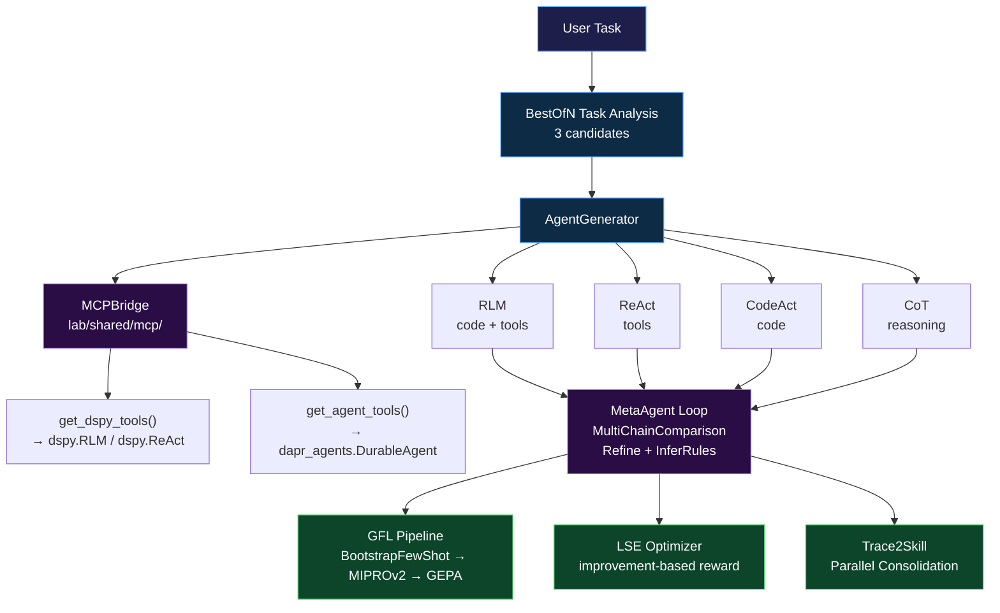
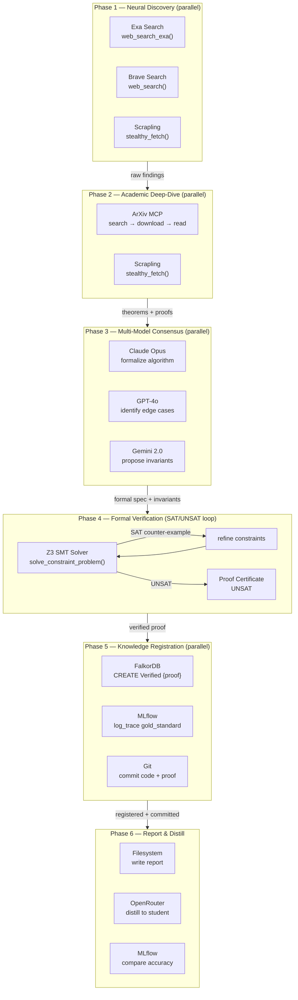
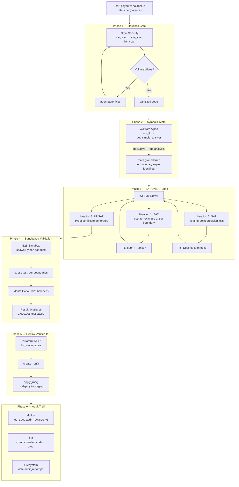
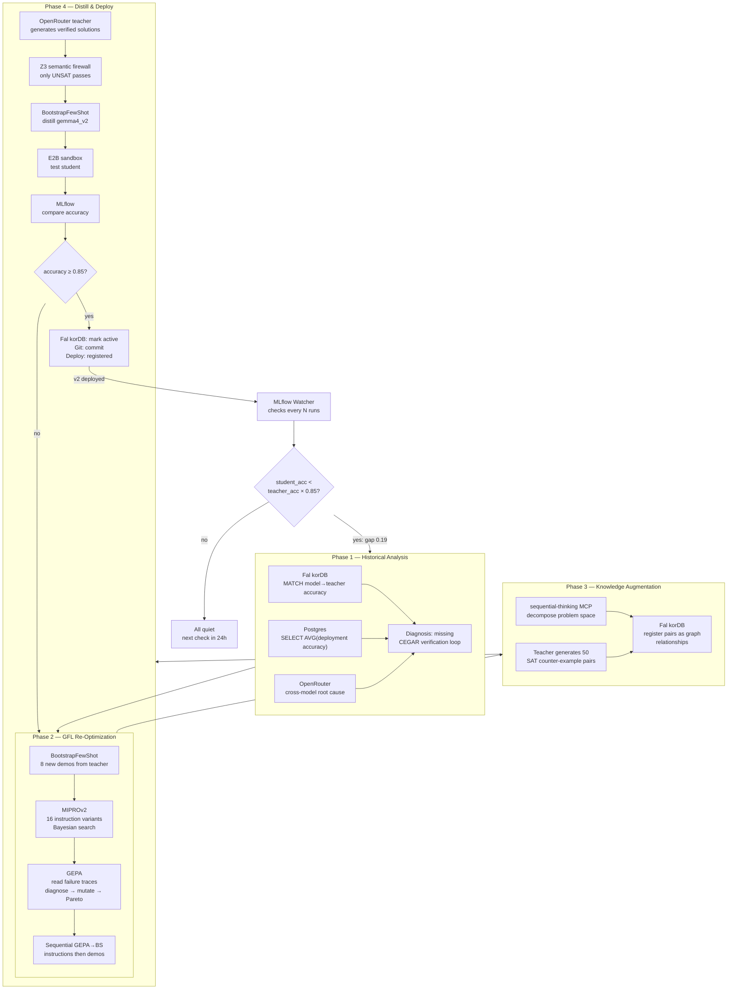
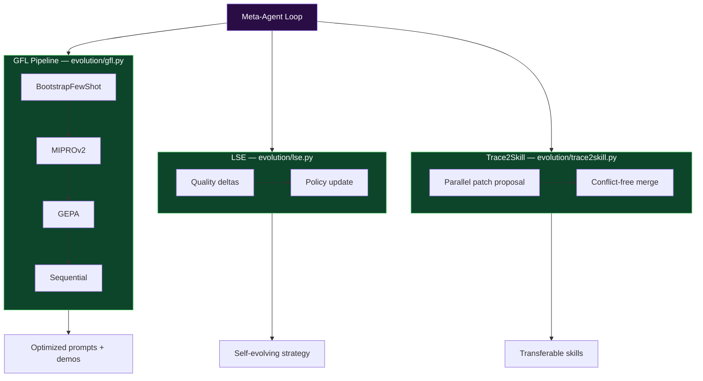

# 13 — Autonomous Software Factory: Verified Multi-Source Intelligence

**The capstone experiment.** Lab 13 extends the meta-agent substrate (labs 11/12) into a **Self-Governing Software Factory** — an agent system that discovers problems, researches solutions, verifies them formally, executes code in sandboxed environments, deploys infrastructure, and logs everything to observability — all governed by zero-code MCP configuration.

## The Stack

```
Ingestion:     Exa (neural search) + crawl4ai (scrape) + Brave (web search) + ArXiv (academic)
Memory:        FalkorDB (knowledge graph) + server-memory (associative) + Postgres (relational)
Reasoning:     DSPy (optimized) + OpenRouter (100+ models, consensus)
Verification:  Z3 (SMT solving) + Snyk (static analysis) + Lean4 (theorem proving)
Execution:     E2B (sandboxed code) + Wolfram Alpha (symbolic math)
Governance:    MLflow (observability, trace management, distillation tracking)
Action:        Terraform (IaC) + Git (version control) + Filesystem (read/write)
```

## What Makes Lab 13 Different

| Aspect | Lab 12 | Lab 13 |
|--------|--------|--------|
| MCP servers | 9 (4 enabled) | **23 (12 enabled)** |
| Tool categories | Research + Verification | **Research + Verification + Search + Memory + Execution + Security + IaC + Observability** |
| Infrastructure | In-tree Z3 server required | **All servers via npx/uvx — zero cloned repos** |
| Shared MCP | Local copies per lab | **`lab/shared/mcp/` — single source of truth** |
| Auth injection | Manual env vars | **Auto-injected via `MCPClient.inject_auth()`** |
| Health checks | None | **Built-in `health_check()` + `auto_reconnect()`** |
| Protocol support | Tools only | **Tools + Resources + Prompts + Sampling** |

## MCP Servers

| Server | Transport | Enabled | Category |
|--------|-----------|---------|----------|
| `crawl4ai` | SSE | ✅ | Web scraping |
| `fetch` | stdio | ✅ | URL fetching |
| `openrouter` | stdio | ✅ | 100+ LLM models, consensus |
| `arxiv` | stdio | ✅ | Academic paper search |
| `exa-search` | stdio | ✅ | Neural web search |
| `filesystem` | stdio | ✅ | Local file read/write/search |
| `git` | stdio | ✅ | Git operations |
| `memory` | stdio | ✅ | Knowledge graph memory |
| `sequential-thinking` | stdio | ✅ | Problem-solving thought chains |
| `time` | stdio | ✅ | Time/timezone conversion |
| `mlflow` | stdio | ✅ | LLM trace observability |
| `falkordb` | stdio | ✅ | Cypher knowledge graph |
| `brave-search` | stdio | ❌ | Web/local search |
| `e2b-sandbox` | stdio | ❌ | Sandboxed code execution |
| `snyk-security` | stdio | ❌ | SAST/SCA/Container/IaC scanning |
| `terraform` | stdio | ❌ | Terraform Registry + Cloud |
| `postgres` | stdio | ❌ | PostgreSQL schema/query |
| `wolfram-alpha` | stdio | ❌ | Symbolic math & computation |
| `playwright` | stdio | ❌ | Browser automation |
| `github` | stdio | ❌ | GitHub API |
| `notion` | stdio | ❌ | Notion workspace |
| `slack` | stdio | ❌ | Slack messaging |
| `google-maps` | stdio | ❌ | Location services |

## Architecture



## Advanced Workflows

### 1. The Self-Funding Research Pipeline

**Concept**: The agent is given a research budget and an autonomous mission — discover a problem, research it deeply, verify the solution formally, register the proven knowledge in a knowledge graph, and publish the result. This demonstrates the full **Discovery → Research → Verification → Memory → Publication** lifecycle.



**What the agent actually does** (autonomously discovered at runtime):

```bash
uv run python -m lab.13_autonomous_factory \
  --query "Research the latest advances in vector clock synchronization for distributed systems. Use Exa for neural discovery, Scrapling for stealth content extraction, and ArXiv for papers. Cross-validate with OpenRouter across 3 models. Formalize the best algorithm, prove its correctness with Z3, register the verified knowledge in FalkorDB, log the proof trail to MLflow, and commit the verified code to git." \
  --iterations 25 run
```

The agent discovers this execution plan on its own through `BestOfN` task decomposition. Each phase is discovered based on tool descriptions — the agent reads `web_search_exa` (Exa), reads `stealthy_fetch` (Scrapling), reads `solve_constraint_problem` (Z3), reads `query_graph` (FalkorDB), and chains them in dependency order. No hardcoded orchestration.

Key capabilities demonstrated:
- **Economic agency**: The agent manages a compute/API budget across 25 iterations, deciding when to use expensive multi-model consensus vs. cheap single-model analysis
- **Self-correcting research**: If Z3 returns SAT, the agent reads the counter-example and refines the constraints — it doesn't ask for help, it fixes the math
- **Verified knowledge registry**: FalkorDB stores only Z3-proven truths, creating a growing library of certified algorithms
- **Full audit trail**: MLflow captures every tool call, every Z3 iteration, and every model response — the entire research process is reproducible

---

### 2. The Zero-Trust Fintech Auditor

**Concept**: A financial compliance agent that audits a multi-tier rewards algorithm, a smart contract invariant, or an IAM policy — combining heuristic security scanning, symbolic mathematics, formal verification, sandboxed execution, infrastructure deployment, and cryptographic audit logging into a single autonomous workflow.



**What the agent actually does — zero-code, purely from MCP tool descriptions:**

```bash
uv run python -m lab.13_autonomous_factory \
  --query "Audit this rewards payout formula for safety violations:
    def payout(balance):
        rate = 0.05 if balance > 10000 else 0.02
        tier = balance // 1000
        return balance * rate * (1 + tier * 0.01)
  Run heuristic scan, symbolic math, formal verification, sandbox stress tests,
  deploy the verified policy to staging via Terraform, and log the complete
  audit trail with proof certificates to MLflow and git." \
  --iterations 20 run
```

Key capabilities demonstrated:
- **Multi-gate security**: Heuristic (Snyk) catches obvious vulns first → saves token cost on Z3 for known-bad code
- **Ground-truth math**: Wolfram Alpha provides deterministic derivative computation — the agent doesn't guess calculus
- **CEGAR verification loop**: Z3 iterates with counter-example feedback until UNSAT, exactly like production formal verification tools
- **Runtime + Logic dual proof**: Z3 proves no violation exists *in any state*; E2B proves it actually runs without errors
- **Closed-loop deployment**: Once verified, the agent deploys without human intervention — the proof certificate is the approval
- **Immutable audit trail**: MLflow logs are append-only; Git commits are immutable. The audit is cryptographically verifiable

---

### 3. The Sovereign Self-Evolving Knowledge Factory

**Concept**: The system operates as a continuous improvement loop, monitoring its own performance via MLflow, detecting accuracy degradation, triggering re-optimization via GFL, evolving its own prompts, and distilling verified knowledge into smaller student models — all while maintaining a verified knowledge graph in FalkorDB and cross-referencing it with historical performance data in Postgres.

This is the capstone meta-workflow — the system improving itself.



**What the agent actually does — the system self-diagnoses and self-heals:**

```bash
# The system monitors its own performance automatically.
# No human prompt needed — the MLflow watcher detects degradation
# and triggers the full re-optimization pipeline.

# But you can also trigger it manually:
uv run python -m lab.13_autonomous_factory \
  --query "Diagnose why the student model accuracy dropped below threshold.
  Query FalkorDB for the model's training history and Postgres for deployment
  performance. Use sequential-thinking to decompose the root cause.
  Then run the full GFL pipeline to re-optimize the student.
  Augment the training set with Z3 counter-example pairs from the teacher.
  Re-distill, verify with E2B sandbox, and deploy if accuracy meets threshold.
  Log every step to MLflow and register the final model in FalkorDB." \
  --iterions 30 gfl
```

Key capabilities demonstrated:
- **Self-diagnosis**: The system detects its own accuracy degradation without human monitoring — MLflow acts as the central nervous system
- **Hybrid memory diagnosis**: FalkorDB (graph relationships between models, teachers, accuracy) + Postgres (time-series performance stats) + OpenRouter (cross-model root cause analysis)
- **Meta-cognitive decomposition**: `sequential-thinking` MCP breaks down the complex self-improvement problem into ordered, checkable steps
- **Counter-example augmented training**: Instead of scraping more data, the system generates its own hard cases via Z3's SAT returns — the verifier becomes a data generator
- **Semantic firewall**: Only Z3-verified (UNSAT) teacher traces enter the student's training set, preventing synthetic data collapse
- **Closed-loop evolution**: The system improves itself, tests itself in a sandbox, deploys itself, and monitors itself — no human in the loop
- **Verified knowledge registry**: FalkorDB grows monotonically with proven truths. Every stored fact carries a Z3 proof certificate. The knowledge base is auditable, verifiable, and self-consistent

## Running

```bash
# Check which servers are available
uv run python -m lab.13_autonomous_factory list-servers

# Health check all connected MCP servers
uv run python -m lab.13_autonomous_factory health

# Run the meta-agent on a task
uv run python -m lab.13_autonomous_factory \
  --query "Research vector optimization and verify with Z3" \
  --iterations 10 run

# GFL optimization
uv run python -m lab.13_autonomous_factory \
  --query "Classify user intent" gfl

# Agent generation (no execution)
uv run python -m lab.13_autonomous_factory \
  --query "Audit a distributed KV store" generate
```

## Prerequisites

| Server | How to Install |
|--------|---------------|
| **crawl4ai** | `docker compose -f lab/08-rlm-mcp/docker-compose.yml up -d` |
| **openrouter** | `npx @physics91/openrouter-mcp init` + set `OPENROUTER_API_KEY` |
| **exa-search** | `EXA_API_KEY` from exa.ai |
| **e2b-sandbox** | `E2B_API_KEY` from e2b.dev |
| **snyk-security** | Install Snyk CLI, set `SNYK_TOKEN` |
| **falkordb** | Docker: `docker run -p 6379:6379 falkordb/falkordb` |
| **mlflow** | `pip install mlflow` + `mlflow server` |
| **wolfram-alpha** | `WOLFRAM_ALPHA_APP_ID` from wolfram.com |

Set API keys in `.env`:

```bash
OPENROUTER_API_KEY=sk-or-...
EXA_API_KEY=...
E2B_API_KEY=...
SNYK_TOKEN=...
WOLFRAM_ALPHA_APP_ID=...
FALKORDB_HOST=localhost
FALKORDB_PORT=6379
MLFLOW_TRACKING_URI=http://localhost:5000
```

## Key Features

- **Zero-code MCP expansion** — add any server via `config/mcp_servers.json`, the meta-agent discovers its tools automatically
- **Auto-injected auth** — `MCPClient.inject_auth()` reads API keys from environment, injects into server configs
- **Health checks** — `health_check()` + `auto_reconnect()` ensure reliable MCP connections
- **Protocol extensions** — Resources, Prompts, and Sampling support in the shared client
- **Dual-format bridge** — tools available as both DSPy callables and `dapr-agents` AgentTools
- **Self-evaluating distillation** — only formally verified traces train the student model

## Research Foundation

Lab 13 builds on three research lines that transform agentic systems from **stochastic guesswork** into **provable self-improvement**:

### Generative Feedback Loops (GFL — DSPy Optimizers)

The meta-agent's GFL pipeline (`evolution/gfl.py`) implements the three-stage optimization loop from DSPy: **Trace Collection → Feedback Generation → Program Update**. The pipeline chains four optimizers in sequence:

- **BootstrapFewShot** — runs teacher modules on training data, collects passing demonstrations, attaches them to student modules. The foundational GFL mechanism.
- **MIPROv2** — joint Bayesian optimization over instruction + demonstration space using Optuna TPE sampling. The recommended default for production.
- **GEPA** — reflective prompt mutation: the LLM reads full execution traces, diagnoses failures, and proposes targeted fixes. Candidates maintained on a Pareto frontier. **Outperforms GRPO by 6%, beats MIPROv2 by 10%+, uses 35× fewer rollouts than GRPO.**
- **BetterTogether** — meta-optimization: prompt optimization (GEPA) → weight optimization (BootstrapFinetune) in alternating sequences.

The GFL pipeline operates at the **program level**, not the model level. No weight updates, no fine-tuning, no RLHF. The LLM's own generative capability is the optimization engine. The same GFL pipeline that optimizes a RAG system today optimizes a multi-agent tool-use pipeline tomorrow — because it operates on prompts and demonstrations, not weights.

```
Reference: DSPy GFL — Khattab et al. (ICLR 2024) + Agrawal et al. (ICLR 2026 Oral)
https://octagono.org/blog/dspy-generative-feedback-loops/
```

### Learning to Self-Evolve (LSE — Meta-Optimization)

The LSE optimizer (`evolution/lse.py`) reframes self-evolution as a reinforcement learning problem. Instead of optimizing prompts directly, it trains a policy that produces **context edits** — modifications to the prompt, examples, or state that improve downstream performance.

The reward function is the key: `r_LSE = R̄(c₁) − R̄(c₀)`, where `c₁` is the context after editing and `c₀` is the context before. This **improvement-based reward** isolates the value of the edit itself, preventing the model from getting credit for improvements it didn't cause. Paired with a **tree-guided exploration loop using UCB selection**, the model explores edits, evaluates their impact, and backtracks when paths go cold.

**A 4B-parameter model trained with LSE outperforms both GPT-5 and Claude Sonnet 4.5** as a self-evolving policy — and the trained policy transfers to completely different models with zero additional training (+6.7% on an Arctic-7B model).

In the meta-agent, LSE operates across agent iterations: each run's quality delta (from the `QualityEvaluation` signature) serves as the LSE reward signal, guiding the meta-agent to refine its agent generation strategy over time.

```
Reference: LSE — Chen et al. (2026), arXiv:2603.18620
https://octagono.org/blog/learning-to-self-evolve/
```

### Trace2Skill — Parallel Skill Consolidation

The Trace2Skill module (`evolution/trace2skill.py`) solves the fundamental problem of skill extraction from agent trajectories. Instead of sequential patching (which overfits to single-trajectory lessons) or retrieval-based approaches (which add runtime overhead), Trace2Skill uses a three-stage approach:

1. **Trajectory Generation**: The meta-agent runs on tasks, producing labeled execution traces — successes and failures, each with full tool-call and reasoning steps.
2. **Parallel Multi-Agent Patch Proposal**: A fleet of DSPy-generated sub-agents analyzes trajectories in parallel — error analysts using ReAct-style causal diagnosis, success analysts identifying generalizable patterns. Each produces patches independently.
3. **Conflict-Free Consolidation**: Patches are merged hierarchically with programmatic conflict detection. Contradictory patches are flagged and resolved before merging. The result is a single, transferable skill — not a pile of trajectory-specific patches.

**Results**: Skills evolved by Qwen3.5-35B transferred to Qwen3.5-122B with **+57.65 percentage points** on WikiTableQuestions. Spreadsheet skills transfer to Wikipedia table QA without modification, showing OOD generalization. The pattern is consistent: parallel analysis of broad experience produces skills that generalize; sequential analysis produces skills that overfit.

```
Reference: Trace2Skill — Ni et al. (2026), arXiv:2603.25158
https://octagono.org/blog/trace2skill/
```

### How They Combine in the Meta-Agent



1. **GFL** optimizes the *local* parameters — prompt instructions and few-shot demonstrations — for each generated agent module
2. **LSE** optimizes the *global* strategy — the meta-agent's own agent generation policy improves across runs based on quality deltas
3. **Trace2Skill** consolidates *cross-run* experience — execution trajectories from both GFL and LSE runs are distilled into reusable, transferable skills

The three layers operate at different granularities (module → agent → system) and reinforce each other. GFL makes each agent better at its task. LSE makes the meta-agent better at generating agents. Trace2Skill makes the accumulated experience reusable across sessions and even across model architectures.

## Shared Infrastructure

All MCP infrastructure is consolidated in `lab/shared/mcp/`:

| Module | What It Provides |
|--------|-----------------|
| `client.py` | `MCPClient` — async-to-sync bridge, auth, health, resources/prompts/sampling |
| `bridge.py` | `MCPBridge` — dual-format tools for DSPy + dapr-agents |
