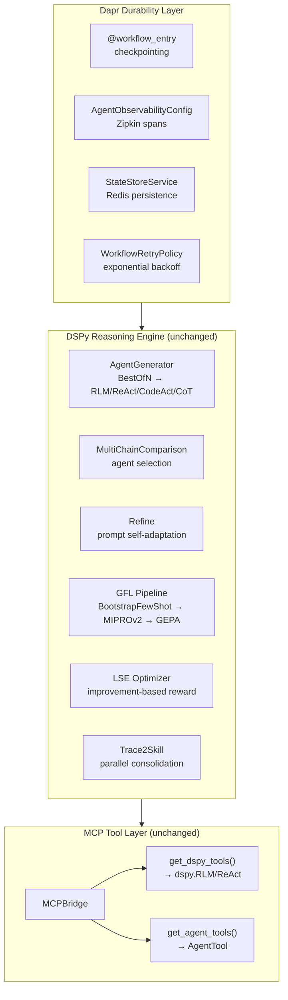
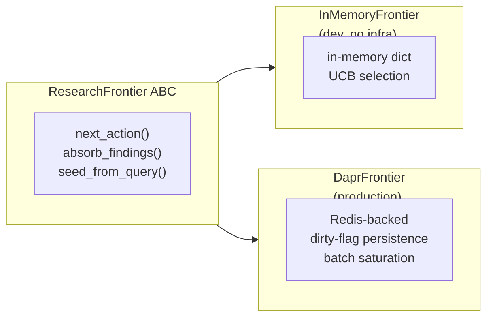
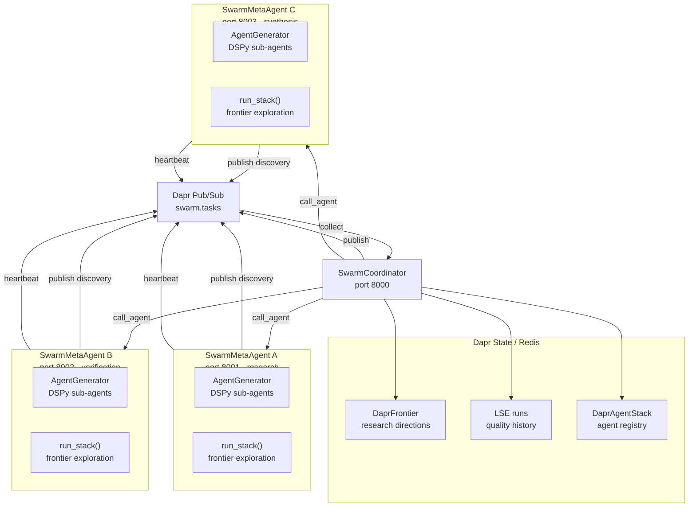
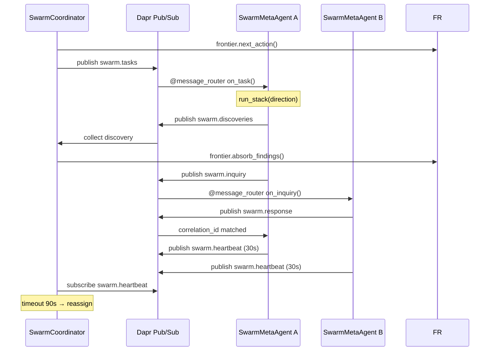

# 14 — Durable Meta-Agent: DSPy + Dapr Production Framework

**The production-hardening experiment.** Lab 14 takes the meta-agent substrate from Lab 13 (Autonomous Software Factory) and wraps it in Dapr durability — without changing a single DSPy module. The same BestOfN task analysis, RLM/ReAct/CodeAct/ChainOfThought agent generation, MultiChainComparison selection, Refine self-adaptation, GFLPipeline optimization, LSE evolution, and Trace2Skill consolidation all remain the core reasoning engine. Dapr adds crash-resistant workflows, state persistence, observability, hot-reload, and secrets management.

## Architecture



| Layer | Technology | Role |
|-------|-----------|------|
| Reasoning engine | **DSPy** — modules, signatures, adapters, optimizers | All ML logic: `dspy.RLM` (recursive code+tools), `dspy.ReAct` (tool loop), `dspy.CodeAct` (code-only), `dspy.ChainOfThought` (reasoning), `BAMLAdapter` (structured output via Pydantic) |
| Tool integration | **MCP** — Model Context Protocol | Tool discovery, auth, health checks, dual-format bridge |
| Durability | **Dapr** — Distributed Application Runtime | Workflow checkpointing, state persistence, observability, retry, secrets |

## What Changed From Lab 13

| Aspect | Lab 13 | Lab 14 |
|--------|--------|--------|
| Meta-agent loop | Single process — crash loses everything | DurableMetaAgent with @workflow_entry — resumes from last checkpoint |
| Agent registry | AgentStack — in-memory dict | DaprAgentStack — Redis-backed, survives restarts |
| Frontier | InMemoryFrontier — volatile UCB | Optional DaprFrontier — Redis-backed + batch saturation cache |
| LSE runs | In-memory list — lost on crash | Optional DaprLSEOptimizer — persisted via StateStoreService |
| Observability | print() statements | AgentObservabilityConfig — Zipkin spans for every iteration |
| Secrets | .env file | Optional secretstore component via Dapr |
| Hot-reload | Restart required | RuntimeSubscriptionConfig — swap LLM at runtime |
| Generated agents | Raw DSPy modules | Optional GeneratedDurableAgent wrapper |

## New Files

```
dapr/
├── __init__.py              # Dapr layer exports
├── wrappers.py              # GeneratedDurableAgent, wrap_module()
├── frontier.py              # DaprFrontier (ported from Lab 10)
├── lse.py                   # DaprLSEOptimizer
├── resources/               # Dapr component YAMLs (state, pubsub, secrets, config)
├── multi-app-run.yaml
├── swarm-multi-app-run.yaml # 4-app swarm: coordinator + 3 workers
core/
└── durable_meta_agent.py    # DurableMetaAgent — Dapr wrapper around DSPy MetaAgent
swarm/
├── coordinator.py           # SwarmCoordinator — dispatches tasks, owns frontier
├── worker.py                # SwarmMetaAgent — subscribes to tasks, publishes findings
├── messages.py              # Pydantic A2A message models (task, discovery, heartbeat, inquiry)
```

## CLI Commands

Pure DSPy commands — no Dapr needed:

```text
generate       Analyze task and generate agents onto the stack
run            Full pipeline: generate -> run stack -> LSE -> consolidate
gfl            Run GFL pipeline (BootstrapFewShot, MIPROv2, GEPA)
stack          Inspect the current agent stack
list-servers   List all configured MCP servers
health         Check connectivity of all configured MCP servers
```

New Dapr commands:

```text
dapr-orchestrator  Start DurableMetaAgent as a Dapr service (requires Dapr sidecar)
dapr-wrap          Show how agents would be wrapped for Dapr deployment
```

Swarm commands (multi-agent coordination):

```text
swarm-coordinator  Start SwarmCoordinator — dispatches tasks to workers via call_agent()
swarm-worker       Start SwarmMetaAgent — subscribes to swarm.tasks, publishes findings
swarm              Run full swarm in-process (coordinator + workers) for testing
```

## Running

### Pure DSPy mode (no Dapr needed)

```bash
uv run python -m lab.14_durable_meta_agent --query "Research topic" --iterations 10 run
```

### Dapr mode (requires Dapr sidecar + Redis)

```bash
# Terminal 1: infrastructure
docker compose -f lab/08-rlm-mcp/docker-compose.yml up -d
redis-server &> /dev/null &

# Terminal 2: start DurableMetaAgent
dapr run --app-id durable-meta-agent --app-protocol grpc --app-port 8000 \
  --resources-path lab/14_durable_meta_agent/dapr/resources -- \
  uv run python -m lab.14_durable_meta_agent \
  --query "Research topic" --iterations 10 \
  dapr-orchestrator --tracing --dapr-frontier --dapr-lse

# Or use multi-app runner:
dapr run -f lab/14_durable_meta_agent/dapr/multi-app-run.yaml
```

## The Dual-Path Pattern

Every subsystem follows the same ABC pattern inherited from Lab 10 — in-memory for dev, Dapr for production:



Same pattern applies to AgentStack/DaprAgentStack and LSEOptimizer/DaprLSEOptimizer.

Swap without changing any DSPy code:

```python
meta = MetaAgent(
    llm=lm,
    generator=generator,
    frontier=InMemoryFrontier(),   # or DaprFrontier()
    stack=AgentStack(),            # or DaprAgentStack()
    lse=LSEOptimizer(),            # or DaprLSEOptimizer()
)
```

## Key Design Decisions

### DSPy Is the Engine, Dapr Is the Chassis

DSPy is configured with `BAMLAdapter` (`dspy.adapters.baml_adapter.BAMLAdapter`) for structured output parsing. This adapter enables Pydantic models (e.g., `ExplorationResult`, `DeepReadResult`, `SynthesisReport`, `Critique` in `agents/research_agents.py`) as first-class output types in DSPy signatures. All DSPy modules throughout the lab benefit from type-validated, schema-enforced outputs — no raw JSON parsing, no prompt-instructed formatting.

The `AgentGenerator` selects the DSPy module type based on the agent's needs:

| Condition | Module | Capability |
|-----------|--------|------------|
| `use_code=True` + tools | `dspy.RLM` | Full REPL agent — runs Python, calls MCP tools, sub-LLM queries |
| Has tools (no code) | `dspy.ReAct` | Tool-using agent with thought-action-observation loop |
| `use_code=True` only | `dspy.CodeAct` | Code-capable agent without tool dependencies |
| Neither | `dspy.ChainOfThought` | Plain CoT with dynamically-created signature class via `type()` |

DSPy is NOT replaced. Dapr is NOT an alternative to DSPy. **DSPy handles all reasoning. Dapr handles all infrastructure.** The `GeneratedDurableAgent` wraps a DSPy module without modifying it:

```python
# DSPy module — unchanged, this is the core engine
dspy_module = dspy.RLM("task: str -> result: str", tools=dspy_tools)

# Dapr durability shell
durable_agent = GeneratedDurableAgent(
    dspy_module=dspy_module,
    name="my-agent", role="assistant",
    tools=agent_tools,        # AgentTool format from MCPBridge
    llm_component="llm-provider",
    enable_tracing=True,
)
```

The `DurableMetaAgent` uses single-phase init with a config dataclass:

```python
from lab.14_durable_meta_agent.core.durable_meta_agent import (
    DurableMetaAgent, DurableMetaConfig,
)

agent = DurableMetaAgent(
    generator=generator,
    tool_defs=tool_defs,
    config=DurableMetaConfig(
        enable_tracing=True,
        use_dapr_frontier=True,
        use_dapr_lse=True,
    ),
)
```

### DRY Iteration Loop: `run_stack_iter()`

The `DurableMetaAgent` does NOT duplicate the iteration loop. `MetaAgent.run_stack_iter()` is a generator that yields `(iteration, direction, entry, prediction, quality, state)` per iteration. `run_stack()` wraps it for result collection. `DurableMetaAgent.run_research()` consumes it directly for checkpointing:

```python
# The single source of truth for the research loop
for iteration, direction, entry, prediction, quality, state in meta.run_stack_iter(
    query, max_iterations
):
    yield ctx.set_state("last_completed_iteration", iteration)
```

### Dirty-Flag Persistence

`DaprFrontier` uses a dirty flag to avoid writing to Redis on every mutation. Calls to `seed_*()` and `absorb_findings()` set `_dirty = True`. The actual `_save()` happens on the next `next_action()` or `saturated()` call via `_flush()`. This batches writes at the natural polling boundary.

### Failed Commands Removed

The original Lab 13 CLI had 6 commands (`optimize`, `distill`, and incorrectly-wired `generate`/`run`/`stack`/`gfl`) that referenced non-existent methods on `MetaAgent`/`GFLPipeline`. These were removed or fixed. The remaining commands now call the correct APIs: `generate_agents()`, `run_stack()`, `snapshot()`.

## Swarm Mode: Multi-Agent Coordination

Lab 14 supports running a **swarm of meta agents** that coordinate via Dapr pub/sub and A2A (Agent-to-Agent) protocol.

### Architecture



### Message Protocol

| Message | Topic | Source | Description |
|---------|-------|--------|-------------|
| `SwarmTask` | `swarm.tasks` | Coordinator | Research direction assigned to a worker |
| `SwarmDiscovery` | `swarm.discoveries` | Worker | Findings published after executing a task |
| `SwarmHeartbeat` | `swarm.heartbeat` | Worker | Liveness signal (alive/busy/error, load, task counts) |
| `SwarmInquiry` | `swarm.inquiry` | Any agent | A2A question to another agent |
| `SwarmResponse` | `swarm.response` | Any agent | A2A answer with correlation_id matching |

### A2A Protocol Flow



### Key Design Decisions

1. **Coordinator owns the frontier** — Only the SwarmCoordinator calls `next_action()` and `absorb_findings()`. Workers are stateless task executors. This avoids distributed locking entirely.
2. **Workers are DurableMetaAgents** — Each worker inherits the full DSPy pipeline: AgentGenerator, GFL optimization, LSE evolution, Trace2Skill consolidation. No changes to DSPy internals.
3. **A2A via pub/sub** — Agents discover each other via Dapr AgentRegistry and communicate through topic-routed messages with correlation_ids for request/response matching.
4. **Heartbeat-based failure detection** — Workers publish liveness every 30s. The coordinator marks a worker offline after 90s of silence and reassigns its tasks.

### Running the Swarm

```bash
# Production: Separate Dapr apps
dapr run -f lab/14_durable_meta_agent/dapr/swarm-multi-app-run.yaml

# Development: In-process swarm
uv run python -m lab.14_durable_meta_agent \
  --query "Research topic" --iterations 10 swarm --workers 3

# Manual: Start coordinator + workers individually
dapr run --app-id swarm-coordinator --app-protocol grpc --app-port 8000 ... swarm-coordinator
dapr run --app-id swarm-worker-0 --app-protocol grpc --app-port 8001 ... swarm-worker --worker-id swarm-worker-0
dapr run --app-id swarm-worker-1 --app-protocol grpc --app-port 8002 ... swarm-worker --worker-id swarm-worker-1
```

## Research Foundation

All DSPy research foundations from Lab 13 apply unchanged:
- **GFL Pipeline** — BootstrapFewShot, MIPROv2, GEPA, Sequential optimizers
- **LSE** — Learning to Self-Evolve with improvement-based reward
- **Trace2Skill** — Parallel skill consolidation from execution trajectories

## Prerequisites

| Dependency | Installation |
|-----------|-------------|
| Python 3.11+ | `uv sync` |
| Dapr CLI | `dapr init` |
| Redis | `redis-server` or Docker |
| Crawl4AI | `docker compose -f lab/08-rlm-mcp/docker-compose.yml up -d` |

Set API keys in `.env` from the project root.
