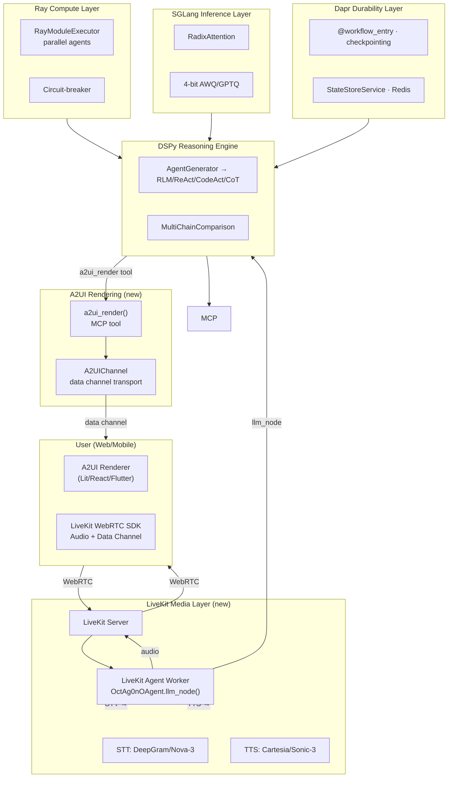

# 15 — Ray + SGLang + LiveKit: Distributed Meta-Agent with Voice & UI

**The scaling, efficiency, and multimodal interaction experiment.** Lab 15 integrates **SGLang** for high-throughput LLM inference (RadixAttention, 4-bit quantization, FP8 KV cache), **Ray** for distributed compute (parallel agent execution), **LiveKit Agents** for voice-based interaction (STT/TTS/WebRTC), and **A2UI** for live UI rendering — all into the Durable Meta Agent from Lab 14.

Every layer is independently usable. `InProcessExecutor` for dev, `RayModuleExecutor` for production. Voice and UI are optional (`livekit-worker` subcommand).

## Architecture



| Layer | Technology | Role | Status |
|-------|-----------|------|--------|
| State & Workflows | **Dapr** | Durable execution, checkpointing, pub/sub | Existing (Lab 14) |
| Reasoning Engine | **DSPy** | Modules, signatures, optimizers, BAMLAdapter | Existing (Lab 14) |
| Tool Integration | **MCP** | Tool discovery, auth, health checks | Existing (Lab 14) |
| Distributed Compute | **Ray** | Task parallelism, resource isolation | **New** |
| Fast Inference | **SGLang** | RadixAttention, continuous batching, 4-bit AWQ, FP8 KV | **New** |
| Voice & Media | **LiveKit Agents** | STT → MetaAgent → TTS pipeline, WebRTC, data channels | **New** |
| UI Rendering | **A2UI (Google)** | Declarative JSON UI protocol, trusted component catalog | **New** |

## The "Full Stack"

| Metaphor | Technology | What it provides |
|----------|-----------|-----------------|
| **Brain / Memory** | Dapr | "What step am I on? What do I know?" |
| **Body** | Ray | "Where should this run? How many in parallel?" |
| **Nervous System** | SGLang | "How fast can I think? Reuse what I've already computed" |
| **Senses** | LiveKit | "Hear and speak — STT/TTS/WebRTC" |
| **Face / Hands** | A2UI | "Render charts, tables, cards on the user's screen" |

## What Changed From Lab 14

| Aspect | Lab 14 | Lab 15 |
|--------|--------|--------|
| Module execution | In-process, sequential | **Ray tasks, parallel across cluster** |
| LLM backend | `dspy.LM(model_name)` → API | **SGLang server → RadixAttention + batching** |
| Model serving | External API (DeepSeek/OpenAI) | **Self-hosted SGLang (AWQ 4-bit + FP8 KV)** |
| LSE optimization | Sequential branch evaluation | **Parallel Ray tasks (capped at 10 branches)** |
| Resource management | None (API-managed) | **Ray task parallelism with circuit-breaker** |

## New Files (from Lab 14, preserved)

```
dapr/                        # Dapr durability layer (preserved from Lab 14)
core/                        # DurableMetaAgent core (preserved)
meta/                        # AgentGenerator, MetaAgent (preserved)
evolution/                   # GFL, LSE, Trace2Skill (preserved)
memory/                      # Frontier, state management (preserved)
swarm/                       # SwarmCoordinator, SwarmMetaAgent (preserved)
mcp/                         # MCPBridge (preserved)
```

## New Files (Lab 15 additions)

```
ray/                         # Ray compute layer
├── executor.py              # ModuleExecutor ABC, InProcessExecutor, RayModuleExecutor
├── lse_parallel.py          # Parallel LSE (capped at 10 branches, reuses RayModuleExecutor)
livekit/                     # LiveKit voice + A2UI + AG-UI integration
├── __init__.py
├── llm_adapter.py           # OctAg0nOAgent(Agent) — llm_node with streaming + thinking steps
├── qwen3_tts.py             # Qwen3-TTS plugin: CustomVoice, VoiceDesign, VoiceClone
├── a2ui_channel.py          # A2UIChannel — v0.10 protocol, surfaces, theming
├── a2ui_transport.py        # A2UITransport ABC — LiveKit data channel or WebSocket
├── agui_handler.py          # AGUIHandler — shared state, frontend tools, interrupt routing
├── interrupts.py            # InterruptSystem — human-in-the-loop confirm/input
├── frontend_tools.py        # Frontend tool defs — geolocation, file picker, clipboard
├── worker.py                # create_server() + run_worker() — AgentServer entrypoint
├── ray_worker.py            # LiveKitWorker — Ray actor for horizontal scaling
mcp/
├── a2ui_tool.py             # a2ui_surface_create, a2ui_show_results, a2ui_show_card, etc.
scripts/
├── launch_sglang.sh         # Start SGLang server (4-bit AWQ + FP8 KV cache)
├── launch_sglang_tp.sh      # Start SGLang with tensor parallelism
├── launch_multi_model.sh    # Launch 4-model hybrid architecture (Llama/DeepSeek/Phi/NeMo)
├── start_livekit_agent.sh   # Start LiveKit agent worker (with or without Ray)
config/
├── models.py                # ModelProfile registry — 4-role hybrid LM config
├── ray_cluster.yaml         # Ray cluster configuration
├── livekit.yaml             # LiveKit server configuration
tests/
├── test_executor.py
```

## Key Design Decisions

### 1. SGLang Is Configuration, Not Code

SGLang exposes an OpenAI-compatible API. DSPy already supports `dspy.LM(model=..., base_url=...)`. RadixAttention, continuous batching, and tensor parallelism are transparent server-side features:

```python
dspy.configure(
    lm=dspy.LM(
        model="openai/meta-llama/Llama-3.1-8B-Instruct",
        base_url="http://localhost:30000/v1",  # SGLang server
    )
)
```

### 2. Ray Tasks, Not Ray Actors

DSPy modules are stateless — they produce fresh predictions each call. Ray actors add lifecycle complexity with no benefit. Tasks let you `ray.get()` results and handle timeouts naturally.

### 3. Dapr + Ray Boundary — Circuit-Breaker Pattern

**Dapr** handles the outer loop (workflow checkpointing, frontier state). **Ray** handles the inner compute (parallel module execution). If Ray fails, fall back to in-process:

```python
def execute_with_fallback(self, module, **kwargs):
    try:
        ref = self._execute_remote.remote(module, kwargs)
        return ray.get(ref, timeout=self.timeout)
    except (ray.exceptions.TimeoutError, ray.exceptions.WorkerCrashedError):
        return InProcessExecutor().execute(module, **kwargs)
```

### 4. LSE Parallelism — Capped and Gated

Only run parallel LSE when quality score drops below threshold. Cap at `min(available_GPUs, 10)` branches. Prevents the overfitting/compute-cost trap.

### 5. Dual-Path Pattern Preserved

| Subsystem | Dev (no infra) | Production |
|-----------|---------------|------------|
| Module execution | `InProcessExecutor` | `RayModuleExecutor` (with circuit-breaker) |
| LLM backend | `dspy.LM(base_url=...)` | `dspy.LM(base_url=sglang:30000/v1)` |
| Parallel evaluation | Sequential | `RayModuleExecutor.execute_batch()` |

### 6. MetaConfig Dataclass Pattern

`MetaAgent` accepts a single `MetaConfig` dataclass (like `DurableMetaConfig`) instead of 9 positional parameters:

```python
from .meta.meta_agent import MetaAgent, MetaConfig

agent = MetaAgent(config=MetaConfig(
    llm=lm,
    generator=gen,  # required — raises ValueError if omitted
    tool_defs=tool_defs,
    executor=RayModuleExecutor(),
))
```

`generator` is required (`__post_init__` raises `ValueError`). All other fields default to sensible in-memory implementations. Add new features as fields on `MetaConfig` instead of constructor parameters.

### 7. Ray Bytes Transport

DSPy modules are serialized via `pickle.dumps()` and the bytes are sent to Ray workers. The serialized bytes are cached per module instance via `_get_module_bytes()`, so modules are pickled at most once. The Ray remote function deserializes and executes on the worker:

```python
# Remote function takes bytes, not live module
@ray.remote
def _execute_remote(module_bytes: bytes, kwargs: dict) -> dict:
    module = pickle.loads(module_bytes)
    prediction = module(**kwargs)
    return {"prediction": prediction}
```

### 8. `@with_bridge` Decorator

All CLI commands receive `(generator, tool_defs)` injected via the `@with_bridge` decorator, eliminating 24 lines of duplicated bridge boilerplate across 8 commands:

```python
@cli.command()
@click.pass_context
@with_bridge
def run(ctx, generator, tool_defs):
    meta = _make_meta(ctx, generator, tool_defs)
    ...
```

### 9. LiveKit llm_node Override with Streaming

`OctAg0nOAgent(Agent)` overrides `llm_node()` to stream research results per iteration. TTS starts speaking as soon as the first iteration completes while remaining iterations compute in parallel:

```python
class OctAg0nOAgent(Agent):
    async def llm_node(self, chat_ctx, tools, model_settings):
        yield "Let me research that."
        async for chunk in self._stream_research(loop, query, surface):
            yield chunk  # Each chunk → TTS → user hears progressively
```

### 10. A2UI v0.10 Protocol over LiveKit Data Channel

A2UI messages follow the v0.10 protocol. The `A2UIChannel` manages multiple UI surfaces with independent lifecycles:

| Method | A2UI Message | Purpose |
|--------|-------------|---------|
| `create_surface(id)` | `createSurface` | Initialize a UI region |
| `update_components(id, comps)` | `updateComponents` | Render components |
| `update_data_model(id, path, val)` | `updateDataModel` | Reactive data binding |
| `delete_surface(id)` | `deleteSurface` | Remove UI region |

High-level UX helpers: `show_loading()`, `show_results()`, `show_card()`, `show_status()`, `show_error()` — each sends correct A2UI protocol messages.

### 11. AG-UI Event Handler (Bi-Directional)

`AGUIHandler` listens for frontend events on the data channel:

| Event | Direction | Purpose |
|-------|-----------|---------|
| `shared_state_update` | Frontend → Agent | Sync state by JSON Pointer path |
| `frontend_tool_result` | Frontend → Agent | Browser API results (geolocation, file) |
| `interrupt_response` | Frontend → Agent | Human-in-the-loop approve/deny |

The `shared_state` property exposes the merged state. `on_state_change(callback)` registers listeners for reactive agent behavior.

### 12. Human-in-the-Loop Interrupts

`InterruptSystem` pauses the agent workflow and asks the user for approval:

```python
interrupts = InterruptSystem(agui_handler, a2ui_channel)

approved = await interrupts.confirm("Generate a security patch for this vulnerability?")
if approved:
    await generate_patch()
```

The agent renders a confirmation card via A2UI, waits for the user's response via AG-UI event (up to 5 min timeout), and resumes based on the result.

### 13. Per-Iteration Streaming + Progressive UI

Research results stream to the user progressively:

1. **Thinking step** — "Analyzing query..." appears in UI data model
2. **Iteration 1** — Text streamed to TTS, progress bar at 33%
3. **Iteration 2** — More text, progress at 66%, partial data in A2UI
4. **Iteration 3** — Synthesis, progress at 100%, final results in A2UI

Each iteration updates the A2UI data model via `update_data_model("/research/iteration_N", ...)`.

### 14. Frontend Tool Calls (Browser APIs as Agent Tools)

Registered alongside MCP tools. AG-UI forwards execution to the frontend:

| Tool | Browser API | Agent Use Case |
|------|-------------|---------------|
| `get_user_location()` | `navigator.geolocation` | "Find restaurants near me" |
| `pick_file(accept)` | `<input type="file">` | "Analyze this spreadsheet" |
| `read_clipboard()` | `navigator.clipboard` | "Use what you copied" |
| `write_clipboard(text)` | `navigator.clipboard` | "Copy results for you" |

### 15. WebSocket Transport Fallback

A2UI works without LiveKit via `WebSocketTransport`:

```python
transport = WebSocketTransport("ws://localhost:8765")
await transport.connect()
channel = A2UIChannel(transport=transport)  # Same API, different transport
```

This enables A2UI in non-voice contexts (web chat, mobile, Slack).

### 16. Ray Scales LiveKit Workers

`LiveKitWorker` is a Ray actor: `@ray.remote(num_cpus=2, num_gpus=0.25)`. Horizontal scaling across the cluster.

### 17. Voice Latency Management

Research iterations capped at 3 for voice. SGLang's RadixAttention caches conversation prefixes across turns. TTS starts streaming as soon as the first iteration completes.

### 18. Qwen3-TTS — Local Voice Synthesis (3 Modes)

Qwen3-TTS replaces cloud TTS with local GPU-accelerated voice synthesis:

| Mode | Description | Model |
|------|-------------|-------|
| **CustomVoice** | 9 preset speakers with NL instruction control (Vivian, Ryan, Serena, etc.) | Qwen3-TTS-12Hz-1.7B-CustomVoice |
| **VoiceDesign** | Generate any voice from natural language description | Qwen3-TTS-12Hz-1.7B-VoiceDesign |
| **VoiceClone** | Clone any voice from a 3-second reference audio sample | Qwen3-TTS-12Hz-1.7B-Base |

Switching: `--tts-backend qwen3 --qwen3-speaker Ryan`

### 19. Multi-Model Hybrid Architecture (May 2026)

Four specialized models served by SGLang, routed by agent role via `dspy.context(lm=...)`:

| Role | Model | Port | Strength | Agent Type |
|------|-------|------|----------|------------|
| **Orchestrator** | Llama 4-12B-Omni | 30001 | Native omni (voice/vision), low latency | Voice interaction, user facing |
| **Researcher** | DeepSeek-V4-Lite-MoE | 30002 | 1.8B active params, extreme throughput | Parallel web research, LSE |
| **Verifier** | Phi-4-Pro-24B | 30003 | Matches GPT-4o at Lean 4/Z3 verification | Formal verification, math |
| **Tool User** | Mistral NeMo-v3-14B | 30004 | Specialized function-calling head | A2UI/MCP tool routing |

```python
from .config.models import configure_all_models

lms = configure_all_models()  # Creates dspy.LM for all 4 roles

with dspy.context(lm=lms["researcher"]):
    findings = research_agent(query="deep dive into topic")
```

Launch all models: `bash scripts/launch_multi_model.sh`

## ray/ Package API

### `ray.executor`

```python
class RayNotAvailableError(ImportError):
    """Raised when Ray is required but pip install ray[default] is missing."""

class ModuleExecutor(ABC):
    """ABC for executing DSPy modules. Dual-path: InProcess | Ray."""
    def execute(self, module: dspy.Module, **kwargs) -> dspy.Prediction: ...
    def execute_batch(self, modules: list, batch_kwargs: list) -> list[Prediction]: ...

class InProcessExecutor(ModuleExecutor):
    """Execute modules in-process. Zero infrastructure. Default."""

class RayModuleExecutor(ModuleExecutor):
    """Execute modules as Ray tasks. Circuit-breaker fallback.

    Modules are serialized via pickle.dumps() and bytes are sent to
    Ray workers (not live module objects). Serialized bytes are cached
    via WeakKeyDictionary (no id() reuse bugs).

    execute_batch preserves input order using an index dict instead of
    concatenating ray_results + fallback_results.

    Raises RayNotAvailableError if ray is not installed.

    Args:
        num_gpus: GPUs per task (0 = CPU, 0.25 = fractional)
        num_cpus: CPUs per task
        timeout: Max seconds for ray.get() before circuit-breaker
    """
    def reset_circuit_breaker(self): ...
    def fallback_count(self) -> int: ...
```

### `ray.lse_parallel`

```python
def parallel_lse_evaluate(
    branches: list[dspy.Module],
    test_cases: list[dspy.Example],
    metric: Callable,
    max_branches: int = 10,
    executor: RayModuleExecutor | None = None,
) -> list[float]:
    """Evaluate LSE branches in parallel (capped at 10). Reuses RayModuleExecutor
    if provided; falls back to sequential evaluation on error or no executor."""
```

## livekit/ Package API

### `livekit.llm_adapter`

```python
class OctAg0nOAgent(Agent):
    """LiveKit Agent with llm_node override → MetaAgent research loop.

    Streams per-iteration results for progressive TTS.
    Pushes thinking steps and progress to A2UI data model.
    Caches results for reconnection durability.
    """
    def __init__(self, meta_agent, max_iterations=3, a2ui_channel=None, agui_handler=None): ...

class get_pending_results(identity: str) -> dict | None:
    """Check for cached research results from a disconnected session."""
```

### `livekit.a2ui_channel`

```python
class A2UIChannel:
    """A2UI v0.10 protocol over data channel. Surface management + theming."""
    def create_surface(self, surface_id, catalog_id=None, theme=None): ...
    def update_components(self, surface_id, components): ...
    def update_data_model(self, surface_id, path, value): ...
    def delete_surface(self, surface_id): ...
    def show_loading(self, surface_id, message): ...
    def show_results(self, surface_id, title, headers, rows, caption=None): ...
    def show_card(self, surface_id, card_id, title, content, badge=None, ...): ...
    def show_status(self, surface_id, message, variant="info"): ...
    def show_error(self, surface_id, message): ...
```

### `livekit.agui_handler`

```python
class AGUIHandler:
    """Bi-directional event handler for AG-UI protocol events."""
    def on_state_change(self, callback): ...
    async def wait_for_interrupt(self, interrupt_id, timeout=300): ...
    @property
    def shared_state(self) -> dict: ...
```

### `livekit.interrupts`

```python
class InterruptSystem:
    """Human-in-the-loop confirmation and input requests."""
    async def confirm(self, description, title="Confirmation Required", timeout=300) -> bool: ...
    async def request_input(self, prompt, field_type="text", timeout=300) -> str | None: ...
```

### `livekit.a2ui_transport`

```python
class A2UITransport(ABC):
    async def send(self, payload: bytes) -> bool: ...

class LiveKitDataTransport(A2UITransport):
    """Default transport — LiveKit data channel."""

class WebSocketTransport(A2UITransport):
    """Fallback — WebSocket for non-voice contexts."""
```

### `livekit.frontend_tools`

```python
def get_user_location() -> dict: ...
def pick_file(accept="*/*") -> dict: ...
def read_clipboard() -> dict: ...
def write_clipboard(text: str) -> dict: ...
```

### `livekit.qwen3_tts`

```python
class Qwen3TTS(tts.TTS):
    """Local TTS via Qwen3-TTS. Modes: custom_voice, voice_design, voice_clone."""
    def __init__(self, model_size="1.7B", mode="custom_voice", speaker="Vivian", ...): ...

class Qwen3TTSStream(tts.ChunkedStream):
    """Audio chunk stream, 100ms frames for low-latency playback."""

# Preset constructors:
qwen3_default_tts(**kwargs) -> Qwen3TTS       # Vivian (Chinese female)
qwen3_english_tts(**kwargs) -> Qwen3TTS        # Ryan (English male)
qwen3_voice_design_tts(**kwargs) -> Qwen3TTS   # Describe voice in NL
qwen3_voice_clone_tts(ref_audio, ref_text) -> Qwen3TTS  # Clone from sample
```

## config/ Package API

### `config.models`

```python
class ModelProfile:
    """SGLang-served model config: name, model_id, port, role, temperature, quant."""
    def to_lm(self) -> dspy.LM: ...

# Four presets:
LLAMA_4_OMNI       # Port 30001, orchestrator role
DEEPSEEK_V4_LITE   # Port 30002, researcher role
PHI_4_PRO          # Port 30003, verifier role
MISTRAL_NEMO_V3    # Port 30004, tool_user role

get_model(role: str) -> ModelProfile       # Lookup by role
configure_lm(role: str) -> dspy.LM         # Create LM for a role
configure_all_models() -> dict[str, dspy.LM]  # Create LMs for all roles
sglang_launch_command(profile) -> str      # Generate SGLang launch cmd
sglang_launch_commands() -> list           # Launch cmds for all models
```

## CLI Flags

| Flag | Default | Description |
|------|---------|-------------|
| `--query, -q` | `""` | Task for the meta-agent |
| `--iterations, -i` | `5` | Max research iterations |
| `--max-llm` | `100` | Max LLM call budget |
| `--max-time` | `300` | Max wall seconds |
| `--max-agents` | `10` | Max agents to generate |
| `--sglang-endpoint` | `""` | SGLang server URL (e.g. `http://localhost:30000/v1`). Sets `dspy.LM(base_url=...)` |
| `--ray / --no-ray` | `False` | Enable Ray task parallelism for agent execution |
| `--tts-backend` | `"livekit"` | TTS backend: `livekit` (cloud) or `qwen3` (local GPU) |
| `--qwen3-mode` | `"custom_voice"` | Qwen3-TTS mode: `custom_voice`, `voice_design`, `voice_clone` |
| `--qwen3-speaker` | `"Vivian"` | Qwen3-TTS speaker: Vivian, Ryan, Serena, Eric, Aiden, Ono_Anna, Sohee |

## Commands

| Command | Description |
|---------|-------------|
| `generate` | Analyze task and generate agents onto the stack |
| `run` | Full pipeline: generate → run stack → LSE → consolidate |
| `gfl` | Run GFL pipeline (BootstrapFewShot, MIPROv2, GEPA) |
| `stack` | Inspect the current agent stack |
| `list-servers` | List all configured MCP servers |
| `health` | Check MCP server connectivity |
| `dapr-orchestrator` | Start as Dapr service (requires sidecar + Redis) |
| `dapr-wrap` | Show DurableAgent-wrapped agent definitions |
| `swarm` | Run swarm in-process (coordinator + workers) |
| `swarm-coordinator` | Start swarm coordinator as Dapr service |
| `livekit-worker` | Start LiveKit agent worker (voice + A2UI) |

### Pure DSPy mode (unchanged from Lab 14)
```bash
uv run python -m lab.15_ray_sglang --query "Research topic" run
```

### SGLang mode (fast inference — highest ROI)
```bash
# Terminal 1: Start SGLang server (4-bit AWQ + FP8 KV cache)
bash lab/15_ray_sglang/scripts/launch_sglang.sh

# Terminal 2: Run with SGLang backend
uv run python -m lab.15_ray_sglang \
  --query "Research topic" \
  --sglang-endpoint http://localhost:30000/v1 \
  run
```

### SGLang + Ray mode (production)
```bash
ray start --head
bash lab/15_ray_sglang/scripts/launch_sglang.sh

uv run python -m lab.15_ray_sglang \
  --query "Research topic" \
  --sglang-endpoint http://localhost:30000/v1 \
  --ray \
  run
```

### Full production stack (Dapr + SGLang + Ray)
```bash
# Start infrastructure
redis-server &> /dev/null &
ray start --head
bash lab/15_ray_sglang/scripts/launch_sglang.sh

# Run
dapr run --app-id ray-meta-agent --app-protocol grpc --app-port 8000 \
  --resources-path lab/15_ray_sglang/dapr/resources -- \
  uv run python -m lab.15_ray_sglang \
  --query "Research topic" \
  --sglang-endpoint http://localhost:30000/v1 \
  --ray \
  dapr-orchestrator --tracing --dapr-frontier --dapr-lse
```

### LiveKit voice agent (with A2UI rendering)
```bash
# Terminal 1: Start LiveKit server (Docker)
docker run --rm -p 7880:7880 livekit/livekit-server \
  --config lab/15_ray_sglang/config/livekit.yaml

# Terminal 2: Start SGLang server
bash lab/15_ray_sglang/scripts/launch_sglang.sh

# Terminal 3: Start LiveKit agent worker
LIVEKIT_URL=ws://localhost:7880 \
LIVEKIT_API_KEY=devkey \
LIVEKIT_API_SECRET=devsecret \
uv run python -m lab.15_ray_sglang \
  --sglang-endpoint http://localhost:30000/v1 \
  livekit-worker

# Or with Ray for parallel workers
LIVEKIT_URL=ws://localhost:7880 \
... \
uv run python -m lab.15_ray_sglang \
  --sglang-endpoint http://localhost:30000/v1 \
  --ray \
  livekit-worker
```

### Qwen3-TTS (local voice, 3 modes)
```bash
# CustomVoice — Vivian (Chinese female, default)
uv run python -m lab.15_ray_sglang \
  livekit-worker --tts-backend qwen3 --qwen3-speaker Vivian

# CustomVoice — Ryan (English male)
uv run python -m lab.15_ray_sglang \
  livekit-worker --tts-backend qwen3 --qwen3-speaker Ryan

# VoiceDesign — describe any voice
uv run python -m lab.15_ray_sglang \
  livekit-worker --tts-backend qwen3 --qwen3-mode voice_design
```

### Multi-model hybrid architecture
```bash
# Terminal 1: Launch all 4 SGLang models
bash lab/15_ray_sglang/scripts/launch_multi_model.sh

# Terminal 2: Use role-specific models via dspy.context
uv run python -m lab.15_ray_sglang \
  --sglang-endpoint http://localhost:30001/v1 \
  --ray \
  run
```

## Resource Efficiency (Realistic)

| Configuration | VRAM (70B model) | Throughput | Status |
|--------------|-------------------|------------|--------|
| FP16 baseline (API) | 140 GB (server) | 1x | Current |
| + SGLang RadixAttention | 140 GB | 2-3x | **Ship today** |
| + 4-bit AWQ quantization | **~35 GB** | 2-3x | **Ship today** |
| + FP8 KV cache | **~25 GB** | 2-3x | **Ship today** |
| + Ray parallel (4 GPUs) | ~25 GB × 1 GPU | **8-12x** | **Ship today** |

## Prerequisites

| Dependency | Installation |
|-----------|-------------|
| Python 3.12+ | `uv sync` |
| Dapr CLI | `dapr init` |
| Redis | `redis-server` or Docker |
| Ray | `pip install ray[default]` or `uv sync --group ray` |
| SGLang | `pip install sglang[all]` or `uv sync --group sglang` |
| Qwen3-TTS | `pip install qwen-tts flash-attn` or `uv sync --group qwen3-tts` |
| LiveKit Agents | `pip install livekit-agents[openai,silero,deepgram,cartesia]` or `uv sync --group livekit` |
| LiveKit Server | `docker run --rm -p 7880:7880 livekit/livekit-server` |
| 4× SGLang models | `bash scripts/launch_multi_model.sh` (requires ~54GB VRAM total) |
| CUDA GPU | Required for SGLang + Qwen3-TTS inference |

**All at once:** `uv sync --group lab15`

See the full integration plan at `.sisyphus/plans/lab-15-ray-sglang-integration.md`.
